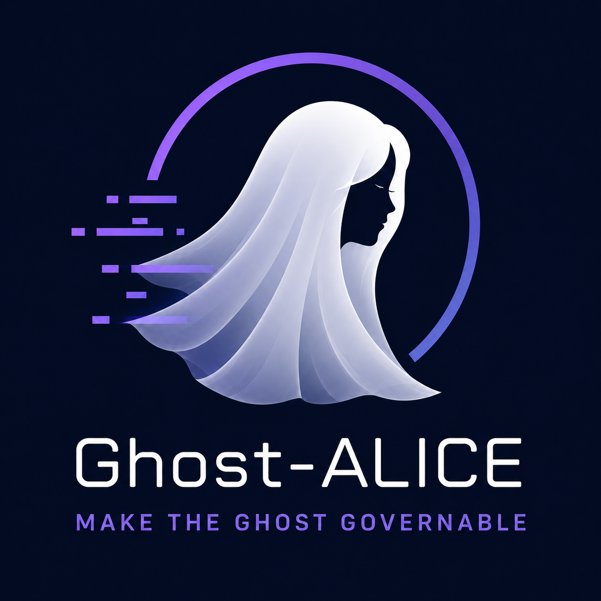

# Ghost-ALICE OS

언어: [🇺🇸 English](./README.md) | 🇰🇷 한국어



> 품질 바닥을 높인다. 보이지 않는 agent를 통제 가능하게 만든다.

Ghost-ALICE OS는 LLM agent 작업이 신뢰 가능한 품질 바닥 아래로 떨어지지 않도록 하는 agent governance operating layer다.

어떤 agent든 컨디션이 나쁜 날이 있을 수 있다고 전제한다. 그런 날에는 뻔한 검사를 건너뛰고, 그럴듯한 답을 과신하고, 제약을 잊고, 검증하지 않은 출처를 인용하고, 그저 생산적으로 보인다는 이유만으로 작업 범위를 넓히기 쉽다.

Ghost-ALICE OS는 의심 많은 operator의 검증 습관을 agent에 심는다. 작업을 의미 단위로 쪼개고, 각 단위를 근거와 제약에 대조하며, agent 혼자 확정하기 어려운 claim에는 source locator를 남기고, mismatch가 보이면 micro/meso/macro/meta 범위를 오가며 다시 확인하고, fresh verification이 나오기 전에는 완료 주장을 막는다.

그래서 agent는 root가 아니다. 실행 권한을 직접 쥐는 대신 governed surface를 거쳐 capability를 요청한다.

Ghost-ALICE OS는 prompt library, chatbot wrapper, 느슨한 skill 묶음이 아니다. 연속성, 경계, 검증, lifecycle control, auditability가 필요한 agent를 위한 governed execution layer다.
## Contents

- [Core Philosophy](#core-philosophy)
- [What Ghost-ALICE OS Governs](#what-ghost-alice-os-governs)
- [Runtime Consequence](#runtime-consequence)
- [Name](#name)
- [Relationship to Agent Skills](#relationship-to-agent-skills)
- [Installation And Update Guide](#installation-and-update-guide)
- [Planning Hub](#planning-hub)
- [Operating Philosophy](#operating-philosophy)
- [Repository Structure](#repository-structure)
- [Skill Authoring And Modification Rules](#skill-authoring-and-modification-rules)
- [Documentation Hub](#documentation-hub)
- [Contributing and Community](#contributing-and-community)
- [License](#license)


## Core Philosophy

Ghost-ALICE OS는 ceiling system이 아니라 floor system이다. 주된 목적은 좋은 날의 expert agent가 낼 수 있는 최고 성과를 더 올리는 것이 아니다. novice, overloaded, overconfident 상태의 agent가 허용 가능한 작업 품질 바닥 아래로 떨어지지 않게 하는 것이다.

운영 모델은 네 가지 습관을 따른다.

- Semantic atomic decomposition: 작업은 파일 수나 tool 수가 아니라 검증 부담에 따라 나눈다.
- Mutual verification loop: 모든 중간 상태를 schema, SSOT, evidence, user constraints, stop conditions에 대조한다.
- Source-grounded claims: agent가 혼자 판단할 수 없으면 실제 외부 또는 로컬 출처를 사용하고 접근 가능한 link 또는 locator를 남긴다.
- Dynamic focus control: 주의 범위는 한 방향으로만 커지지 않는다. macro mismatch는 meso sub-task, micro tool call, 또는 원래 구조로 되돌아가게 만들 수 있다. 사용자 상호작용, mismatch 위치, 검증 부담이 현재 layer를 결정한다.

"Agents are not root"는 출발점이 아니라 runtime consequence다. agent creativity는 허용하지만 execution authority, completion claims, new work creation, scope expansion은 먼저 governance를 지난다.

## What Ghost-ALICE OS Governs

| Surface | Governance role |
| --- | --- |
| User intent | context shift가 있어도 goals, constraints, locked decisions, non-goals, stop conditions를 유지한다. |
| Skill activation | agent가 매번 절차를 즉흥적으로 만들지 않게 작업을 적절한 capability로 라우팅한다. |
| Boundaries | high-risk 또는 ambiguous work 전에 allowed/prohibited surface를 선언한다. |
| Tool use | files, shell commands, browsers, MCP tools, external services를 governed execution surface로 취급한다. |
| Drift resistance | current request를 session intent와 비교해 jailbreak, instruction override, scope drift를 감지한다. |
| Verification | evidence burden이 높을 때 claims, outputs, completion statements를 closed-loop check에 통과시킨다. |
| Lifecycle | installation, updates, local modifications, pending merges, handoffs, uninstall cleanup을 추적한다. |
| Auditability | 무엇을 왜 건드렸고 어떤 규칙이 허용했는지 설명할 수 있는 trace를 남긴다. |

## Runtime Consequence

Agents are not root.

agent는 user-space reasoning process다. 검증되지 않은 실행은 품질을 floor 아래로 떨어뜨리는 경로이므로 agent가 실행을 직접 소유해서는 안 된다. agent는 governed runtime layer를 통해 capability를 요청해야 한다.

```text
User request
  ↓
session-intent-analyzer
  ↓
governance consumers
  ├─ capability routing
  ├─ boundary / security gates
  └─ completion criteria
  ↓
boundary-contract, when needed
  ↓
skill activation / capability routing
  ↓
execution surface
  ├─ files / shell / browser / MCP / external tools
  └─ documents / code / datasets
  ↓
closed-loop verification
  ↓
audit trace / handoff / lifecycle gate
```

목표는 쓸모 있는 creativity가 verification을 건너뛰지 못하게 막으면서, autonomous intent를 통제 가능하고 검사 가능하며 재현 가능한 execution으로 바꾸는 것이다. internal routing이 있지만, 이는 model 전면에 드러나는 중심이 아니라 shared intent state를 소비하는 내부 단계다.

## Name

Ghost-ALICE라는 이름은 서로 맞서는 두 힘을 한데 담는다.

ghost는 우리 눈에 보이지 않는 블랙박스 같은 인공지능을 상징한다. 유용하고 빠르고 강력하지만, 불투명하며 인간의 직접적인 주의 밖에서 움직일 수 있다.

ALICE는 adaptive governance layer를 상징한다. 사용자의 intent를 보존하고, boundary를 유지하고, evidence를 확인하고, autonomous behavior를 inspectable execution으로 바꾸는 거버넌스를 뜻한다.

Ghost-ALICE OS는 general-purpose operating system이나 standalone agent runtime이 아니다. `OS`는 governance를 durable하게 만드는 layer를 뜻한다. session gates, installer state, platform adapters, audit traces, verification contracts가 그 layer다.

## Relationship to Agent Skills

Ghost-ALICE OS는 [Agent Skills Open Standard](https://github.com/agentskills/agentskills)를 capability packaging layer로 사용한다.

Ghost-ALICE OS에서 skill은 단순한 prompt fragment가 아니다. skill은 instructions, references, scripts, templates, activation rules, compliance checks, runtime boundaries를 가진 versioned governed capability다.

각 skill은 Ghost-ALICE Phase 1-5 compliance checks에 맞춰 관리된다. upstream Agent Skills format은 packaging substrate를 제공하고, Ghost-ALICE OS는 session-level governance, routing, verification, lifecycle control, audit traces를 더한다.

Ghost-ALICE OS는 third-party capability에 열려 있다. 누구든 addon으로 skill을 패키징하고 `bash install.sh --addon-source <path>`로 설치할 수 있다. addon은 `addons-manifest.json` index와 per-addon `addon.json`을 제공하며, addon skill name은 core skill과 충돌하면 안 된다. addon path는 addon entries를 resolve/list하고 selected platform에 addon skill directories를 install한다. [addon authoring guide](https://github.com/AidALL/ghost-alice/wiki/addon-authoring_ko)가 manifest 형식과 예시를 설명한다.

## Installation And Update Guide

처음 시작할 때는 [team onboarding wiki](https://github.com/AidALL/ghost-alice/wiki/team-onboarding_ko)를 본다. prerequisites, platform-specific install commands, skill updates, FAQ를 다룬다.

`git pull`, merge conflict, PowerShell reinstall 단계가 update 중 실패하면 [install troubleshooting wiki](https://github.com/AidALL/ghost-alice/wiki/install-troubleshooting_ko)를 먼저 본다. 이 페이지는 repo를 pull하지 못하는 상황에서도 읽을 수 있다. repo 안의 대응 문서는 [docs/ko/getting-started/troubleshooting.md](./docs/ko/getting-started/troubleshooting.md)다.

Quick install:

```bash
git clone https://github.com/AidALL/ghost-alice.git ~/ghost-alice
cd ~/ghost-alice
bash install.sh
```

Windows:

```powershell
.\install.ps1
```

CMD:

```bat
install.cmd
```

`install.cmd`는 `install.ps1`을 호출하는 얇은 wrapper다. Windows install path는 Python 3.11+ runtime contract와 UTF-8 console setup을 `install.ps1`에 유지한다. CMD wrapper는 argument만 전달한다.

Agent visibility command surface:

- Claude Code는 workspace command로 `/visibility strict|dynamic|minimal`을 사용한다.
- Codex는 trusted `UserPromptSubmit` hook pseudo-command path를 통해 `/visibility`를 처리한다.
- 모든 platform은 `_shared/agent_visibility_cli.py`를 통해 같은 profile 값을 확인하고 변경할 수 있다.
- install-time default는 `dynamic`다. initial profile은 `bash install.sh --visibility dynamic` 또는 `.\install.ps1 -Visibility dynamic`으로 설정한다. `--agent-visibility`와 `-AgentVisibility`는 compatibility alias로 유지한다.
- Visibility는 user-facing governance message surface만 바꾼다. hook execution, strict-grade logs, Work-Impact Projection은 약화하지 않는다.

Detailed docs:

- [Installation and update guide](./docs/ko/getting-started/installation.md)
- [Troubleshooting](./docs/ko/getting-started/troubleshooting.md)
- [Uninstall cleanup procedure](./docs/ko/getting-started/uninstall.md)

Release validation:

```bash
python3 scripts/validate_public_surfaces.py
```

validator는 public docs, command wrappers, catalog references가 `skill-catalog/skills.json`과 정렬되어 있는지 확인한다. domain과 tenant capability는 `--addon-source`를 통한 optional addon install이다.

현재 `skill-catalog/skills.json` snapshot에는 top-level 10 skills와 14 coding-convention sub-skills, total 24가 있다.

- top-level skills 10 (adversarial-verification, agent-security-scan, boundary-contract, compact-handoff, jailbreak-detector, merge-companion, necessity-gate, session-intent-analyzer, skill-evolution, task-router)
- coding-convention family 14 sub-skills (brainstorming, dispatching-parallel-agents, executing-plans, finishing-a-development-branch, receiving-code-review, requesting-code-review, subagent-driven-development, systematic-debugging, test-driven-development, using-coding-convention, using-git-worktrees, verification-before-completion, writing-plans, writing-skills)

Quick full uninstall:

```bash
bash install.sh --uninstall
```

```powershell
.\install.ps1 -Uninstall
```

```cmd
install.cmd -Uninstall
```

## Planning Hub

Public planning guidance는 [docs/ko/plans/README.md](./docs/ko/plans/README.md)에 있다. local backlog, private integration notes, speculative roadmap items는 public repository에 두지 않는다.

## Operating Philosophy

- Ghost-ALICE OS는 floor system이다. 가장 강한 operator의 ceiling을 올리려는 것이 아니라 agent work의 minimum acceptable quality를 보호한다.
- complex work는 한 번에 결론 내지 않는다. semantic atoms로 나눈 뒤 각 상태를 evidence에 대조한다.
- current state는 schema, SSOT, evidence, constraints와 비교한다. mismatch가 나타나면 agent가 고치거나 human에게 넘긴다.
- 외부 또는 로컬 출처에 의존하는 claim은 accessible links, file locations, source locators를 남긴다.
- focus scope는 고정되지 않고 한 방향으로만 커지지도 않는다. user interaction, mismatch location, verification burden이 micro, meso, macro, meta 사이의 이동을 결정한다.
- Hook value는 다음 work decision을 바꿀 때 중요하다. 그 decision은 focus, boundary, verification burden, recovery path다. Visibility는 이 work-impact judgment보다 보조적이다.
- complexity는 tool count보다 verification burden으로 판단한다. source selection, mapping interpretation, format constraints, recovery cost 모두 추가 verification loop를 요구할 수 있다.
- `calls`는 static and sparse relationship만 표현한다. 반복 re-verification loop는 runtime procedure에 속한다.
- 긴 design discussion은 bundled release docs가 아니라 public wiki 또는 issues에 둔다.

## Repository Structure

상세 repository map은 [docs/ko/reference/repository-structure.md](./docs/ko/reference/repository-structure.md)에 있다.

## Skill Authoring And Modification Rules

`AGENTS.md`가 SSOT다. 자세한 wording과 platform-specific exceptions는 [AGENTS.md](./AGENTS.md)와 [platforms/codex/AGENTS.md](./platforms/codex/AGENTS.md)를 우선한다.

새 skill을 만들거나 기존 skill을 수정한 뒤에는 [official-docs/derived/skill-compliance-checklist.md](./official-docs/derived/skill-compliance-checklist.md)의 Phase 1-5를 통과해야 한다.

session gate contract는 [skill-catalog/session-gates.json](./skill-catalog/session-gates.json)에서 생성되고 `python scripts/check_skill_gate_contract.py`로 검사한다.

## Documentation Hub

English가 default repository entry path다. Korean 문서는 `README_ko.md`, `docs/ko/`, paired Wiki pages에 reader-facing mirror로 유지한다. 각 English 문서는 Korean counterpart로 링크하고, 각 Korean 문서는 matching English page로 돌아간다.

| Topic | English | Korean |
| --- | --- | --- |
| Root README | [README.md](./README.md) | README_ko.md |
| Document index | [docs/README.md](./docs/README.md) | [docs/ko/README.md](./docs/ko/README.md) |
| Language policy | [docs/concepts/language-policy.md](./docs/concepts/language-policy.md) | [docs/ko/concepts/language-policy.md](./docs/ko/concepts/language-policy.md) |
| Installation and update | [docs/getting-started/installation.md](./docs/getting-started/installation.md) | [docs/ko/getting-started/installation.md](./docs/ko/getting-started/installation.md) |
| Troubleshooting | [docs/getting-started/troubleshooting.md](./docs/getting-started/troubleshooting.md) | [docs/ko/getting-started/troubleshooting.md](./docs/ko/getting-started/troubleshooting.md) |
| Repository structure | [docs/reference/repository-structure.md](./docs/reference/repository-structure.md) | [docs/ko/reference/repository-structure.md](./docs/ko/reference/repository-structure.md) |
| Skill catalog guide | [docs/reference/skills.md](./docs/reference/skills.md) | [docs/ko/reference/skills.md](./docs/ko/reference/skills.md) |
| Runtime gate matrix | [docs/policies/session-gate-matrix.md](./docs/policies/session-gate-matrix.md) | [docs/ko/policies/session-gate-matrix.md](./docs/ko/policies/session-gate-matrix.md) |
| Installer platform compatibility | [docs/policies/installer-platform-compatibility-matrix.md](./docs/policies/installer-platform-compatibility-matrix.md) | [docs/ko/policies/installer-platform-compatibility-matrix.md](./docs/ko/policies/installer-platform-compatibility-matrix.md) |
| Tool output semantics | [docs/policies/tool-output-semantics.md](./docs/policies/tool-output-semantics.md) | [docs/ko/policies/tool-output-semantics.md](./docs/ko/policies/tool-output-semantics.md) |
| Platform adapter compliance | [docs/policies/platform-adapter-compliance.md](./docs/policies/platform-adapter-compliance.md) | [docs/ko/policies/platform-adapter-compliance.md](./docs/ko/policies/platform-adapter-compliance.md) |
| Live smoke regression | [docs/policies/live-smoke-regression.md](./docs/policies/live-smoke-regression.md) | [docs/ko/policies/live-smoke-regression.md](./docs/ko/policies/live-smoke-regression.md) |
| Evaluator artifact contract | [docs/policies/evaluator-artifact-contract.md](./docs/policies/evaluator-artifact-contract.md) | [docs/ko/policies/evaluator-artifact-contract.md](./docs/ko/policies/evaluator-artifact-contract.md) |
| Planning docs | [docs/plans/README.md](./docs/plans/README.md) | [docs/ko/plans/README.md](./docs/ko/plans/README.md) |
| Public release checklist | [docs/release/public-release-checklist.md](./docs/release/public-release-checklist.md) | [docs/ko/release/public-release-checklist.md](./docs/ko/release/public-release-checklist.md) |
| Addon authoring | [wiki: addon authoring](https://github.com/AidALL/ghost-alice/wiki/addon-authoring) | [wiki: addon authoring ko](https://github.com/AidALL/ghost-alice/wiki/addon-authoring_ko) |

## Contributing and Community

contribution은 behavior, safety, documentation, verification evidence 기준으로 review한다. 특히 Ghost-ALICE OS가 실제 agent failure를 어디서 막는지, governance output을 어디에 다르게 보여야 하는지, `strict`, `dynamic`, `minimal` visibility profile이 core gate execution을 약화하지 않고 어디서 개선될 수 있는지에 대한 workflow-level feedback을 원한다.

- Maintainer: [@garlicvread](https://github.com/garlicvread)
- Public questions, bugs, feature requests: GitHub Issue를 연다.
- Private project 또는 security contact: `aidall_manager@aidall.tech`
- personal email address는 이 project에서 monitor하지 않는다.

- Contribution guide: [CONTRIBUTING.md](./CONTRIBUTING.md)
- Code of conduct: [CODE_OF_CONDUCT.md](./CODE_OF_CONDUCT.md)
- Security policy and private vulnerability reporting: [SECURITY.md](./SECURITY.md)
- Support and where to ask questions: [SUPPORT.md](./SUPPORT.md)
- Release notes: [CHANGELOG.md](./CHANGELOG.md)

public issues 또는 pull requests에 secrets, private prompts, customer data, local runtime state를 포함하지 않는다.

## License

Ghost-ALICE OS project-owned source code와 documentation은 Apache License, Version 2.0으로 배포된다.

bundled third-party reference material과 provenance notes는 [LICENSE](./LICENSE), [NOTICE](./NOTICE), [THIRD_PARTY_NOTICES.md](./THIRD_PARTY_NOTICES.md)를 본다.
