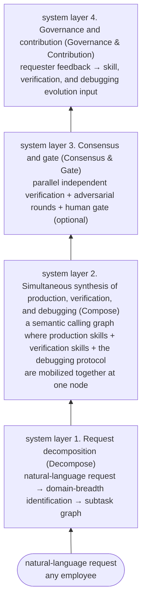

# Ghost-ALICE OS System Architecture

This document organizes the system vision and design tracks of Ghost-ALICE OS. Ghost-ALICE OS is not a general-purpose operating system or a standalone agent runtime. It is an agent governance operating layer that manages the work boundary, verification, session intent, install state, and platform-specific hook behavior of an AI agent session.

Documentation boundary: this repository document is the compact architecture map. Long-form design background lives in the Wiki. The "four-layer model" below describes the knowledge-work lifecycle axis; Wiki pages may use Layer 0-5 wording for the runtime governance stack. Those are different axes, not competing layer counts.
## Contents

- [0. Purpose and Non-Purpose](#0-purpose-and-non-purpose)
  - [0.1 Purpose](#01-purpose)
  - [0.2 Non-Purpose (what this system does not solve)](#02-non-purpose-what-this-system-does-not-solve)
  - [0.3 User Spectrum (no single assumption)](#03-user-spectrum-no-single-assumption)
- [1. Four-Layer Model (System Skeleton)](#1-four-layer-model-system-skeleton)
  - [Layer 1: Request Decomposition (Decompose)](#layer-1-request-decomposition-decompose)
  - [Layer 2: Simultaneous Synthesis of Production, Verification, and Debugging (Compose)](#layer-2-simultaneous-synthesis-of-production-verification-and-debugging-compose)
  - [Layer 3: Consensus and Gate (Consensus & Gate)](#layer-3-consensus-and-gate-consensus-gate)
  - [Layer 4: Governance and Contribution (Governance & Contribution)](#layer-4-governance-and-contribution-governance-contribution)
- [2. Spectrum Adaptation Principle (Adaptive Activation)](#2-spectrum-adaptation-principle-adaptive-activation)
  - [2.1 Activation Dimensions](#21-activation-dimensions)
  - [2.2 Activation Matrix (example)](#22-activation-matrix-example)
  - [2.3 Over-Engineering Prevention Principle](#23-over-engineering-prevention-principle)
- [3. Non-Functional Constraints](#3-non-functional-constraints)
  - [3.1 Korean Tone](#31-korean-tone)
  - [3.2 Non-Coding Contributor Friendliness](#32-non-coding-contributor-friendliness)
  - [3.3 Deployment Surface Separation](#33-deployment-surface-separation)
  - [3.4 Connection to Per-Deployment Assets](#34-connection-to-per-deployment-assets)
- [4. Design Decisions](#4-design-decisions)
  - [Request Decomposition Engine](#request-decomposition-engine)
  - [Semantic Calling Graph Representation](#semantic-calling-graph-representation)
  - [Consensus Protocol](#consensus-protocol)
  - [Complexity Classification and Verification Policy](#complexity-classification-and-verification-policy)
  - [Runtime Value Judgment](#runtime-value-judgment)
- [5. Mapping to Existing Components](#5-mapping-to-existing-components)

---

## 0. Purpose and Non-Purpose

### 0.1 Purpose

When a user throws a request in natural language, Ghost-ALICE OS automatically performs the following.

- Identifies the domain breadth of the request and the requester profile
- Determines and composes the required skills semantically
- Activates the appropriate verification layer at the same time as production
- Runs the debugging loop together when the requester gets stuck
- Delivers the agreed output to the requester and receives the requester's feedback as system evolution input

The final goal is to automate the boundary setting, decomposition, verification, and feedback loop of repeatable knowledge work. The domains span a wide range of work categories, including development, research, document work, operations work, and market research.

### 0.2 Non-Purpose (what this system does not solve)

- It does not replace the final judgment of external experts (lawyers, patent attorneys, external auditors, medical experts). A domain that needs a human gate calls the gate explicitly inside the system
- It does not perform automation that the user explicitly refused
- It does not perform unauthorized collection or transmission of external data

### 0.3 User Spectrum (no single assumption)

This system does not assume a single requester profile. The same system handles all of the following.

- A non-coding business-team member requesting a dataset validation tool
- A senior developer requesting NeRF code debugging
- A researcher requesting English polishing of a paper abstract
- A marketer requesting a competitor market-share survey
- A one-line chore that anyone throws, such as a calendar entry
- A PM requesting review of a regulation-based proposal draft

The domain is not a single one either. The same system handles everything from single-domain work (documents only, research only, development only, marketing only) to multi-domain cross-cutting work.

---

## 1. Four-Layer Model (System Skeleton)

### Layer 1: Request Decomposition (Decompose)

Responsibilities
- Takes a natural-language request and identifies domain breadth, requester profile, and work complexity
- Builds a single node for a single domain, and an N-node graph for multi-domain cross-cutting work
- Identifies semantic calling candidate skills (the frontmatter description is the detection input)
- When information is undecided, throws one clarification question at a time to the requester (borrowing the brainstorming pattern)

Non-Responsibilities
- Does not produce output (layer 2 does that)
- Does not make verification or debugging decisions (performs only complexity classification and domain identification)

Input: one to several lines of natural language
Output: a subtask graph (node = task, edge = dependency), each node's semantic calling candidates + task-complexity-level-1/2/3 complexity + domain

### Layer 2: Simultaneous Synthesis of Production, Verification, and Debugging (Compose)

Responsibilities
- Calls production skills and verification skills together at each node of the graph
- The debugging protocol steps in when the requester gets stuck during production (a non-coder demo failure) or the system gets stuck (a code error)
- Debugging branches by mode according to the requester profile. Coder mode (systematic-debugging) and non-coder mode (screenshot and natural-language extraction + one change at a time)
- Operates as closed-loop reasoning that repeatedly compares the intermediate state against the schema, the SSOT, the evidence, and the constraints
- When node production finishes, passes the result to layer 3

Non-Responsibilities
- Does not apply consensus rules (layer 3 does that)
- Does not redo decomposition (follows the layer 1 result)

Core principle: production skills and verification skills go into the same catalog as equals. A verification skill's frontmatter description also works as a detection input. However, the runtime's re-verification loop itself is not entirely placed on the calls graph.

### Layer 3: Consensus and Gate (Consensus & Gate)

Responsibilities
- Verifies node results in parallel and independently (n agents independently evaluate the same result)
- Runs mutually adversarial rounds (each agent attacks another agent's conclusion)
- Decides pass or fail according to the consensus rule (unanimity / majority / weighted, differing by domain)
- When a domain needs a human gate, requests review from the requester or an external expert
- Delivers a passing result to the requester, and returns a failing result to layer 2 for the debugging loop

Non-Responsibilities
- Does not modify the production itself (modification is the layer 2 debugging loop)
- Does not apply consensus rules uniformly regardless of domain (follows the domain policy)

Fixed zone: number of agents. Verification-complexity-level-1 exempt (no round entry), verification-complexity-level-2 fixed at 3, verification-complexity-level-3 fixed at 3 + dynamic selection of 2 from an expansion pool of 4 = 5. Consensus rule. Unanimity (default) / majority / weighted, caller-specified. Termination condition. Convergence judgment after round >= 5, round ceiling 50.
Undecided zone: the human-gate trigger policy. This is set in a separate policy document.

### Layer 4: Governance and Contribution (Governance & Contribution)

Responsibilities
- When the requester discovers a "better direction for next time" after production, receives that feedback as system evolution input
- Provides both a coding-role contribution path (PR + code review) and a non-coding-role contribution path (natural-language feedback → the system generates skill-patch candidates)
- Logs the source provenance of every output (which agent made which decision)
- Tracks policy changes, new domain additions, and runtime contract changes

Non-Responsibilities
- Does not intervene directly in production, verification, or debugging (meta-management of the layer 1 to 3 results)

---

## 2. Spectrum Adaptation Principle (Adaptive Activation)

The four-layer model is the skeleton, and the activation intensity of each layer is determined dynamically by request complexity x domain x requester profile. Running all four layers at full power for every request is over-engineering and a system failure.

### 2.1 Activation Dimensions

Dimension A. Request complexity
- task-complexity-level-1 simple: one node, single domain, self-evident output (example: a calendar entry)
- task-complexity-level-2 medium: 5 to 10 nodes, 1 to 2 domains, needs format and citation verification (example: a regulation-based proposal draft)
- task-complexity-level-3 cross-cutting: 10+ nodes, 3+ domains, multi-layer verification + debugging loop (example: a dataset validation tool full stack)
- Complexity looks not only at node count but also at the verification burden together. That is, even a seemingly simple copy-paste can become task-complexity-level-2 or above if it needs source selection, format mapping, and after-the-fact comparison

Dimension B. Domain
- chores (calendar, email check, short official letter)
- documents (proposals, reports, manuals, official letters, legal first drafts, academic papers)
- research (experiment design, statistical analysis, citation verification, reproducibility)
- development (code writing, debugging, packaging, deployment, security)
- market research and marketing (factual grounding, source citation, tone consistency)

Dimension C. Requester profile
- coding-capable roles (developers, researchers): debugging coder mode, can review code directly.
- coding-incapable roles (business, marketing, some PMs): debugging non-coder mode, demo-based review.
- For domain experts, such as lawyers, accountants, or researchers in their own expert domain, the requester takes on part of the domain-meaning verification.
- For domain non-experts, meaning roles outside the domain, the system takes on all of the domain-meaning verification.

### 2.2 Activation Matrix (example)

| request example | complexity | domain | requester | layer 1 decomposition | layer 2 verification | layer 2 debugging | layer 3 gate |
|-----------|--------|--------|--------|----------|----------|-----------|-----------|
| book a meeting tomorrow at 3 | task-complexity-level-1 | chore | anyone | 1 node | time conflict only | none | none |
| polish this paper abstract in English | task-complexity-level-1 | document | researcher | 1 to 2 | tone and grammar | none | self |
| summarize the share of 5 competitors | task-complexity-level-2 | marketing | marketer | 3 to 5 | facts and sources | none | self |
| fix this NeRF code error | task-complexity-level-1 to task-complexity-level-2 | development | developer | 1 to 3 | code multi-layer | strong coder mode | self |
| regulation-based proposal draft | task-complexity-level-2 | document + regulation | operations team | 5 to 10 | format, evaluation metrics, regulation | short | expert option |
| one core-technology paper | task-complexity-level-2 to task-complexity-level-3 | research + development | researcher | 8 to 15 | statistics, reproducibility, citation | coder mode | self + co-authors |
| dataset validation tool full stack | task-complexity-level-3 | 9-domain cross-cutting | non-coding business team | 15+ | full power | non-coder 4-hop | auto-reinforced |

This table is an example and is not exhaustive. Each skill performs its complexity branching at its own entry gate (distributed).

### 2.3 Over-Engineering Prevention Principle

- No adversarial consensus rounds for a task-complexity-level-1 request
- No forced human gate for a task-complexity-level-1 request (the requester gets the result immediately)
- The debugging protocol activates only when an actual block occurs (no preemptive activation)
- The verification layer activates at each skill's entry gate according to complexity and domain

---

## 3. Non-Functional Constraints

### 3.1 Korean Tone
All Korean outputs use the plain declarative style (the ~da / ~handa / ~ida / ~haera endings). English outputs follow the English convention. User-facing responses use the same tone (honorific and casual banmal endings prohibited). Markdown bold emphasis in output bodies is prohibited (express with the □ / ○ / - markers, headers, or structure).

### 3.2 Non-Coding Contributor Friendliness
SKILL.md is a living doc, and contributions should come from outside coding roles too. That is, the frontmatter, CI, and compliance checklist must not become an absolute entry barrier for non-coding contributors. Non-coding feedback is received in natural language, and the system generates patch candidates (layer 4).

### 3.3 Deployment Surface Separation
Ghost-ALICE OS core separates the publicly releasable governance layer from per-organization private profiles. Per-organization data is managed as separate profile/assets, and the core documents do not require any specific private deployment premise.

### 3.4 Connection to Per-Deployment Assets

- The public core documents describe only generic extension points
- Tenant profile, private integration, and per-organization tech-stack decisions are managed outside the public core
- An addon capability must pass the core governance gate, but addon names and internal operating premises are not enumerated in the public core documents

---

## 4. Design Decisions

This chapter records the design decisions reflected in the current implementation and document contracts.

### Request Decomposition Engine
- Resolution method: task-router semantically scans the skill descriptions in the system-reminder and matches production, verification, and lifecycle skills. The answer to the "classifier vs decomposer vs hybrid" question is "description-keyword semantic scan + distributed task-complexity-level-1/2/3 classification"
- Clarification questions: the brainstorming skill handles them. task-router only performs matching
- Semantic calling algorithm: the LLM directly compares the description text loaded into the system-reminder. No separate embedding or vector DB
- No undecided items

### Semantic Calling Graph Representation
- Resolution method: because the `calls` graph is kept static and sparse, extensions such as validates/validated-by/debugs/augments were unnecessary
- Current type enum: hard | soft | union | meta | external-hard | external-union
- Dynamic relationships (verification attachment, debugging loop, and so on) are not placed on the calls graph and are expressed by the body prose and the runtime
- Graph serialization: a frontmatter YAML list adopted as the single source of truth
- No undecided items

### Consensus Protocol
- Number of agents: verification-complexity-level-1 exempt, verification-complexity-level-2 fixed at 3 (internal-logic, external-fact, internal-fact), verification-complexity-level-3 at 5 (fixed 3 + dynamic selection of 2 from a pool of 4). Pool: external-logic, edge-case, prior-art, incentive
- Consensus rule: unanimity (default) / majority / weighted. Caller-specified, unanimity when unspecified
- Adversarial round termination condition: convergence judgment after round >= 5, round ceiling 50, a checkpoint every 5 rounds (SSOT re-comparison, no mediation)
- Action on consensus failure: the meta-judge writes a deadlock-report and passes it to a human. The meta-judge has no decision authority
- Implementation: adversarial-verification/SKILL.md

### Complexity Classification and Verification Policy
- Resolution method: each skill performs the task-complexity-level-1/2/3 branching at its own entry gate. There is no central lookup table
- task-complexity-level-1/2/3 classification overview: defined in section 2.1 of this document
- Per-domain verification intensity: decided by each skill's internal rules
- Over-engineering prevention: enforced by section 2.3 of this document

### Runtime Value Judgment
- Resolution method: hook-internal values are judged by work impact before display. A value matters when it can change the next focus layer, work boundary, verification burden, or recovery path
- `agent_visibility.profile` remains a user-screen verbosity preference. It is not the primary design axis for model reasoning or quality governance
- Routine values stay complete in the strict audit log, but they should not drive focus or model-facing hints unless they affect work quality
- Forced/risk/gate values and failed verification bypass profile reduction because they can change the next work decision

## 5. Mapping to Existing Components

This organizes where the current implementation components fit in the four-layer model.

| component | location | note |
|------|------|------|
| task-router/SKILL.md | layer 1 runtime implementation | AGENTS.md rule 0 forces the call. Scans the skill descriptions in the system-reminder and matches production, verification, and lifecycle skills. Lifecycle includes necessity-gate |
| session-intent-analyzer/SKILL.md | layer 1 intake and governance state | Records digest-only user-input observations and accumulates compressed session intent. It is the first user-input intake after pending-merge precheck and is consumed by jailbreak-detector, skill-evolution, and task-router |
| jailbreak-detector/SKILL.md | governance gate before routing | Compares current intent against accumulated constraints and records `model_security_decision`. Only current-lineage block decisions are carried downstream |
| downstream-gates.json | governance state between intake and tool use | Written only for current-lineage block decisions. Absence is silent allow. `tool-checkpoint` reads this state and does not inspect tool payload content |
| boundary-contract/SKILL.md | layer 1 / layer 2 boundary lock | Declares objective, non-goals, allowed surfaces, prohibited surfaces, acceptance criteria, and stop conditions before implementation or verification work |
| tool-checkpoint | PreToolUse / BeforeTool governance checkpoint | Hook-enforced full-schema retry point. It is not user-input intake and is not a semantic safety classifier. Its decision depends only on the current-lineage downstream block gate |
| verification-before-completion/SKILL.md | layer 3 completion evidence gate | Requires fresh verification evidence and claim-evidence mapping before completion, recommendation, choice, or success claims |
| io-trace hook and prompt surface | governance transparency layer | PostToolUse audit log plus prompt-visible `[io-trace]` summary. It records file/tool access metadata without storing raw prompts or secrets |
| skill-evolution/SKILL.md | layer 4 report-only evolution input | Consumes session intent and io-trace patterns to produce Instinct candidate reports. It does not automatically modify skills |
| compact-handoff/SKILL.md | governance continuity support | Preserves evidence, state, and next actions across context compaction without changing hook behavior |
| agent-security-scan/SKILL.md | governance audit support | Performs report-only static scans of settings, hooks, skills, MCP config, credential surfaces, and exposure risks |
| necessity-gate/SKILL.md | governance (layer 4), step 7 gate | Work-necessity verification. Fires on an initialization event. Blocks speculative, padding, and manufactured work. The step 7 implementation of the 8-step fallback-forwarding loop |
| skill-catalog/skills.json | layer 1 input | Semantic calling candidate search index. The target of description embedding |
| skill-catalog/schema.json | layer 1 / layer 2 interface | The 6 calls-type enum values are fixed; see the Semantic Calling Graph Representation decision in section 4 |
| frontmatter calls | layer 2 semantic calling graph | hard/soft/union/meta are static expressions. Used as a hint during dynamic synthesis |
| scripts/build_catalog.py | governance (layer 4) | Index build |
| scripts/validate_skills.py | governance (layer 4) | One format-verification layer. Different from the domain verification of the output. Phase 1 to 5 automatic verification. For manual items, refer to the automatic/manual columns of the table in official-docs/derived/skill-compliance-checklist.md |
| scripts/validate_entrypoints.py | governance (layer 4) | Entry-point smoke test. Checks task-router and using-coding-convention existence, body, catalog registration, platform-port rule 0 consistency, and SSOT-to-port title parity as a CI gate |
| _shared/install_hooks.py | governance (layer 4) | Automatic UserPromptSubmit hook install. Idempotently merges the task-router reminder hook into Claude Code's settings.json and Codex's hooks.json + config.toml feature flag. Auto-called from install.sh/install.ps1. Reinforces rule 0 against loss after context compaction with the hook payload, and a session without hook payload evidence falls back to each platform bootstrap's hookless/manual fallback |
| scripts/fetch_design_catalog.py | governance (layer 4) | design-library/catalog re-collection. Via the npm getdesign tarball, applies COLLISION_MAP, automatically refreshes manifest/.source-meta |
| .github/workflows/skill-validation.yml | governance (layer 4) | PR merge gate. Skill consistency verification (Phase 1 to 5) |
| .github/workflows/skill-gate-contract.yml | governance (layer 4) | PR merge gate. Session gate contract consistency verification (session-gates.json ↔ SSOT synchronization) |
| .github/PULL_REQUEST_TEMPLATE.md | governance (layer 4) | Coding-role PR channel |
| official-docs/derived/skill-compliance-checklist.md | governance (layer 4) | Format-layer verification of the skill itself. Different from output domain verification |
| coding-convention/* (14 of them) | layer 2 production, verification, and debugging pool | brainstorming → layer 1, systematic-debugging → layer 2 coder mode, verification-before-completion → layer 3 |
| domain and addon skill cluster | layer 2 production and verification | For the current list, refer to `skill-catalog/skills.json` and addon manifests. The description of each core skill is in the `README.md` entry table. To prevent drift, this architecture map does not carry a hard-coded skill count |
| merge-companion | governance (layer 4) | User-change isolation and merge gate. Install-time snapshot/diff, the `~/.ghost-alice/pending-merges/<platform>/manifest.json` SSOT, the SessionStart hook + 5 fallback layer triggers. adversarial-verification with no exception |
| hooks/post-merge | governance (layer 4) | Re-runs `install.sh --platform codex` only when a Codex copy-mode install is detected (`~/.codex` exists). Symlink/junction platforms are already live after `git pull`, so the hook exits without reinstalling them |
| merge-companion/scripts/manifest_io.py | governance (layer 4) | manifest read/write/append/mark_decided. Atomic write (tempfile + os.replace) + POSIX flock (Windows best-effort) |
| merge-companion/scripts/snapshot.py | governance (layer 4) | Install-time file_hash capture. sha256 deterministic. Symlink filtering is the caller's responsibility |
| merge-companion/scripts/diff_collector.py | governance (layer 4) | snapshot vs current comparison, isolated backup of user changes, manifest entry append, automatic READ-ME-FIRST.md generation (the pending-merge-readme layer of the eight-surface activation guarantee) |

Defined boundaries
- compliance checklist Phase 1 to 5 is "format verification of the skill itself". Separated from the domain verification of the output.
- validate_skills.py is a frontmatter linter. It is a different component from the runtime verification system.
