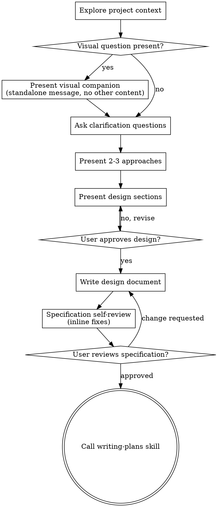

# Turning Ideas into Designs

Develop an idea into a complete design and specification through natural collaborative conversation.

First understand the current project context, then refine the idea by asking one question at a time. Once you understand what to build, present the design and obtain user approval.

#### Prohibition Rules

Do not call implementation skills. Do not write code. Do not run project scaffolding. Do not take implementation actions. Hold off until you present the design and the user approves it. Apply this to every project, no matter how simple it looks.
## Contents

- [Anti-pattern: "Too simple to need a design"](#anti-pattern-too-simple-to-need-a-design)
- [Checklist](#checklist)
- [Process Flow](#process-flow)
- [Process](#process)
- [After the Design](#after-the-design)
- [Core Principles](#core-principles)
- [Visual Companion](#visual-companion)

## Anti-pattern: "Too simple to need a design"

Every project goes through this procedure. To-do lists, single-function utilities, configuration changes, all of them. In "simple" projects, unexamined assumptions cause the most wasted work. A design can be short (a few sentences for a truly simple project), but you must present it and obtain approval.

## Checklist

Create a task for each item below and complete them in order:

1. Explore the project context. Review files, documents, and recent commits.
2. Present the visual companion (when visual questions are expected). A standalone message, not merged with other content. See the visual companion section below.
3. Clarification questions. One at a time, to understand the objective, constraints, and success criteria.
4. Present 2 to 3 approaches. Include trade-offs and a recommendation.
5. Present the design. Organize sections to match complexity, and request approval after each section.
6. Write the design document. Save it to `docs/coding-convention/specs/YYYY-MM-DD-<topic>-design.md` and commit.
7. Specification self-review. A quick check for placeholders, contradictions, ambiguity, and scope (see below).
8. Have the user review the written specification. Request review of the specification file before proceeding.
9. Transition to the implementation stage. Call the writing-plans skill to build the implementation plan.

## Process Flow

The terminal state is calling writing-plans. Do not call frontend-design, mcp-builder, or other implementation skills. After brainstorming, the only call target is writing-plans.

## Process

Understand the project:

- First check the current project state (files, documents, recent commits).
- Assess scope before asking detailed questions. If the request describes several independent subsystems (for example, "build a chat, file storage, payment, and analytics platform"), flag it immediately. Do not waste questions refining project details that need decomposition.
- If the project is too large for a single specification, help the user decompose it into sub-projects. What are the independent pieces, how do they relate, and in what order should they be built. Then brainstorm the first sub-project through the normal design flow. Each sub-project has its own specification, plan, and implementation cycle.
- For an appropriately scoped project, refine the idea by asking one question at a time.
- Prefer multiple-choice questions when possible, but open-ended questions are fine too.
- One question per message. If a topic needs more exploration, split it into several questions.
- Focus on understanding the objective, constraints, and success criteria.
- When you need to confirm the user's intent, verify your understood weighting, scope, and residual possibilities rather than a simple choice.
  Example: "The core cause I understand is X, and is it correct to leave Y and Z as residual possibilities?"
- When the user gives a concrete example, ask about the judgment criteria the example reveals rather than the example itself.

Explore approaches:

- Present 2 to 3 different approaches together with their trade-offs.
- Present the options conversationally with a recommendation, and explain the reasoning.
- Lead with the recommended option and explain why.

Present the design:

- When you judge that you understand what to build, present the design.
- Match each section to its complexity. A few sentences when simple, up to 200 to 300 characters for nuanced parts.
- After each section, ask whether it is correct so far.
- Content to include: architecture, components, data flow, error handling, testing.
- If something is unclear, prepare to clarify.

Design for isolation and clarity:

- Divide the system into small units. Each unit has one clear purpose. They communicate through well-defined interfaces. They can be understood and tested independently.
- For each unit, you should be able to answer: what does it do, how do you use it, what does it depend on.
- Can you understand what a unit does without reading its internals? Can you change its internals without breaking consumers? If not, you need to work on the boundary.
- Small, clearly bounded units are also easier to work with. You reason better about code you can hold at once, and edits are more reliable when a file stays focused. When a file grows large, it is often a signal that it does too much.

Working in an existing codebase:

- Explore the current structure before proposing changes. Follow existing patterns.
- If existing code has a problem that affects the work (for example, a file that grew too large, unclear boundaries, or tangled responsibilities), include targeted improvements as part of the design. The way a good developer improves the code they are working in.
- Do not propose unrelated refactoring. Keep your focus aligned with the current objective.

## After the Design

Documentation:

- Write the validated design (the specification) to `docs/coding-convention/specs/YYYY-MM-DD-<topic>-design.md`.
  - (A user preference for the specification location overrides this default.)
- Use the elements-of-style:writing-clearly-and-concisely skill when it is available.
- Commit the design document to git.

Specification self-review:

After writing the design document, look at it with fresh eyes:

1. Scan for placeholders. Any "TBD", "TODO", incomplete sections, or vague requirements? Fix them.
2. Internal consistency. Do sections contradict each other? Does the architecture match the feature description?
3. Scope check. Is it focused enough for a single implementation plan, or does it need decomposition?
4. Ambiguity check. Can any requirement be interpreted in two different ways? Pick one and make it explicit.

Fix problems inline. No re-review is needed. Just fix them and proceed.

If you judge that self-review alone is not enough, dispatch a subagent to run a stricter review of the specification document. The prompt template used here is defined in references/spec-document-reviewer-prompt.md.

User review gate:

After passing the specification review loop, ask the user to review the written specification before proceeding:

"The specification is written and committed to `<path>`. Before I start writing the implementation plan, please review it and tell me what you want to change."

Wait for the user's response. If they request changes, make them and re-run the specification review loop. Proceed only after the user approves.

Implementation:

- Call the writing-plans skill to build a detailed implementation plan.
- Do not call any other skill. writing-plans is the next step.

## Core Principles

One question at a time. Do not overwhelm with several questions.
Prefer multiple choice. It is easier to answer than open-ended.
Remove YAGNI relentlessly. Strip unnecessary features from every design.
Explore alternatives. Always present 2 to 3 approaches before settling.
Incremental verification. Present the design, get approval, then proceed.
Stay flexible. If something is unclear, go back to clarify.

## Visual Companion

A browser-based companion shows mockups, diagrams, and visual options during brainstorming. It is available as a tool, not a mode. Accepting the companion means visual processing is available for questions where it helps. It does not mean every question goes through the browser.

Present the companion:

When an upcoming question is expected to include visual content (mockups, layouts, diagrams), present it once for consent:

"Some of this work might be easier to explain in a web browser. I can prepare mockups, diagrams, comparisons, and other visuals as we go. This feature is still new and can consume many tokens. Should I try it? (Opening a local URL is required.)"

This presentation must be its own message. Do not merge it with a clarification question, a context summary, or any other content. The message must contain only the presentation above and nothing else. Wait for the user's response. If they decline, proceed with text-only brainstorming.

Decide per question:

Even after the user accepts, decide whether to use the browser or the terminal for each question. The test: is it easier for the user to see than to read?

Use the browser. Visual content: mockups, wireframes, layout comparisons, architecture diagrams, side-by-side visual designs.
Use the terminal. Text content: requirement questions, conceptual choices, trade-off lists, A/B/C/D text options, scope decisions.

A question about a UI topic is not automatically a visual question. "What does personality mean in this context?" is a conceptual question, use the terminal. "Which wizard layout is better?" is a visual question, use the browser.

If you agree to the companion, read the detailed guide before proceeding:
`skills/coding-convention/brainstorming/references/visual-companion.md`
