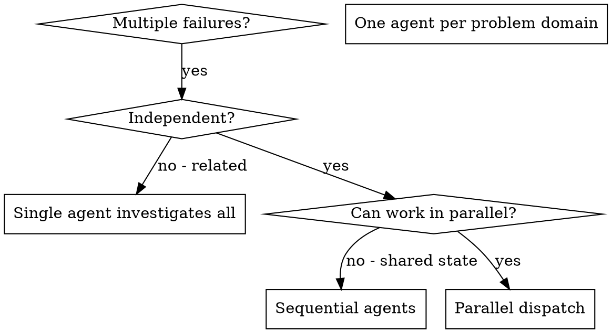

# Dispatching Parallel Agents
## Contents

- [Overview](#overview)
- [When to Use](#when-to-use)
- [Pattern](#pattern)
  - [1. Identify Independent Domains](#1-identify-independent-domains)
  - [2. Create Focused Agent Tasks](#2-create-focused-agent-tasks)
  - [3. Dispatch in Parallel](#3-dispatch-in-parallel)
  - [4. Review and Integrate](#4-review-and-integrate)
- [Agent Prompt Structure](#agent-prompt-structure)
- [Common Mistakes](#common-mistakes)
- [When Not to Use](#when-not-to-use)
- [Key Benefits](#key-benefits)
- [Verification](#verification)


## Overview

Delegate work to specialized agents with an isolated context. Construct precise instructions and context so each agent focuses on its own task. An agent must never inherit the session context or history. Construct only exactly what it needs. This preserves your own context for coordination work.

When there are several unrelated failures (different test files, different subsystems, different bugs), investigating them sequentially is a waste of time. Each investigation is independent and can proceed in parallel.

Core principle: dispatch one agent per independent problem domain. Have them work at the same time.

## When to Use



When to use:
- 3 or more test files fail, with different causes
- Several subsystems are broken independently
- Each problem can be understood without the context of the others
- There is no shared state between investigations

When not to use:
- The failures are related (fixing one may fix the others)
- You need to understand the whole system state
- The agents could interfere with each other

## Pattern

### 1. Identify Independent Domains

Group the failures by the broken area:
- File A tests: tool approval flow
- File B tests: batch completion behavior
- File C tests: abort feature

Each domain is independent. A tool approval fix does not affect the abort tests.

### 2. Create Focused Agent Tasks

Each agent receives:
- A concrete scope: one test file or subsystem
- A clear goal: make these tests pass
- Constraints: do not change other code
- Expected output: a summary of what was found and what was fixed

### 3. Dispatch in Parallel

```typescript
// In a Claude Code / AI environment
Task("Fix agent-tool-abort.test.ts failures")
Task("Fix batch-completion-behavior.test.ts failures")
Task("Fix tool-approval-race-conditions.test.ts failures")
// All three tasks run at the same time
```

### 4. Review and Integrate

When the agents return:
- Read each summary
- Confirm the fixes do not conflict
- Run the full test suite
- Integrate all changes

## Agent Prompt Structure

A good agent prompt is:
1. Focused: one clear problem domain
2. Self-contained: includes all the context needed to understand the problem
3. Specific about the output: what is the agent expected to return?

```markdown
Fix the 3 failing tests in src/agents/agent-tool-abort.test.ts:

1. "should abort tool with partial output capture" - the message expects 'interrupted at'
2. "should handle mixed completed and aborted tools" - a fast tool is aborted instead of completing
3. "should properly track pendingToolCount" - expects 3 results instead of 0

This is a timing/race-condition problem. Tasks:

1. Read the test file and understand what each test verifies
2. Identify the root cause: is it a timing issue or a real bug?
3. Fix as follows:
   - Replace arbitrary timeouts with event-based waiting
   - Fix any bug found in the abort implementation
   - If it is a behavior-change test, adjust the test's expected value

Do not blindly increase the timeout. Find the real issue.

Return: a summary of what was found and what was fixed.
```

## Common Mistakes

Too broad: "Fix all tests" - the agent gets lost
Specific: "Fix agent-tool-abort.test.ts" - a focused scope

No context: "Fix the race condition" - the agent does not know the location
With context: paste the error message and the test name

No constraints: the agent can refactor everything
With constraints: "Do not change production code" or "Fix only the tests"

Vague output: "Fix it" - you do not know what changed
Specific: "Return a summary of the root cause and the changes"

## When Not to Use

Related failures: fixing one may fix the others. Investigate them together first.
Full context needed: when the understanding has to look at the whole system
Exploratory debugging: when you do not yet know what is broken
Shared state: when the agents could interfere (editing the same file, using the same resource)

## Key Benefits

1. Parallelization: several investigations proceed at the same time
2. Focus: each agent has a narrow scope, with less context to track
3. Independence: the agents do not interfere with each other
4. Speed: solve 3 problems in the time it takes to solve 1

## Verification

When the agents return:
1. Review each summary: understand what changed
2. Check for conflicts: did the agents edit the same code?
3. Run the full suite: do all fixes work together?
4. Spot-check: the agents can make systematic errors
