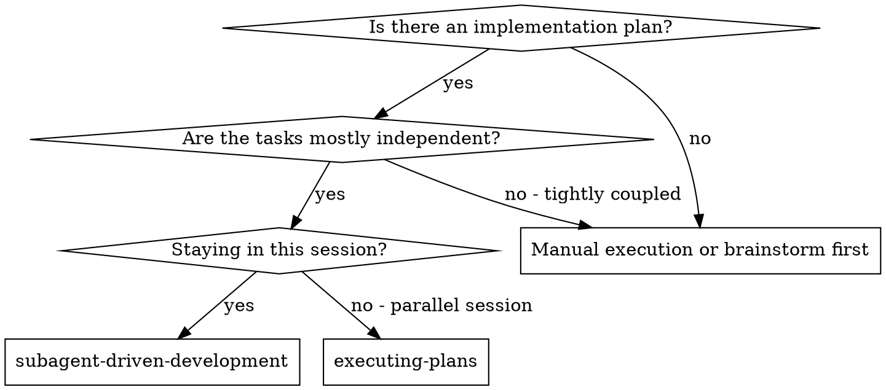
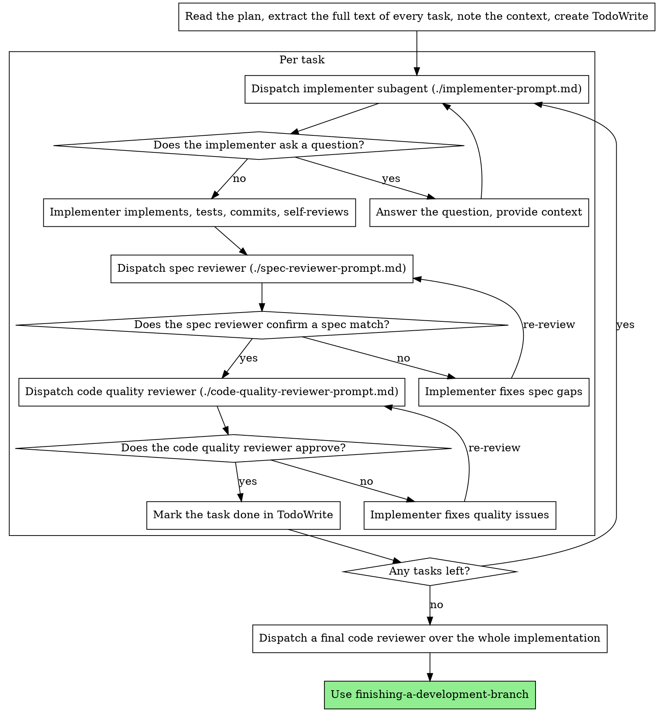

# Subagent-Driven Development

Dispatch a fresh subagent per task to execute the plan. After every task, run a two-stage review: spec compliance review first, then code quality review.

○ Why subagents

Delegate each task to a specialized agent with an isolated context. Make the instructions and context precise so the agent stays focused on the task and succeeds. The agent must never inherit your session's context or history. You construct exactly what the agent needs. This also preserves your own context for coordination work.

○ Core principle

A fresh subagent per task plus a two-stage review (spec then quality) supports
focused work and faster correction.
## Contents

- [When to Use](#when-to-use)
- [Procedure](#procedure)
- [Model Selection](#model-selection)
- [Handling Implementer States](#handling-implementer-states)
- [Prompt Templates](#prompt-templates)
- [Example Workflow](#example-workflow)
- [Benefits](#benefits)
- [Red Flags](#red-flags)
- [Integration](#integration)

## When to Use

□ Difference from executing-plans (parallel session)

- Same session (no context switch)
- A fresh subagent per task (no context contamination)
- A two-stage review after every task: spec compliance first, then code quality
- Faster iteration (no human intervention between tasks)

## Procedure

## Model Selection

To save cost and improve speed, use the weakest model that can handle each role.

□ Mechanical implementation work (isolated function, clear spec, 1-2 files)

Use a fast, cheap model. When the plan is well specified, most implementation work is mechanical.

□ Integration and judgment work (multi-file coordination, pattern matching, debugging)

Use the standard model.

□ Architecture, design, and review work

Use the strongest available model.

□ Task complexity signals

- A complete spec in 1-2 files → low-cost model
- Multiple files with integration concerns → standard model
- Design judgment or broad codebase understanding required → strongest model

## Handling Implementer States

The implementer subagent reports one of four states. Handle each appropriately.

□ DONE

Proceed to the spec compliance review.

□ DONE_WITH_CONCERNS

The implementer finished the task but flagged a doubt. Read the concern before proceeding. If the concern is about correctness or scope, address it before the review. If it is an observation (for example, "this file is growing"), note it and proceed to the review.

□ NEEDS_CONTEXT

The implementer needs information that was not provided. Provide the missing context and redispatch.

□ BLOCKED

The implementer cannot complete the task. Assess the blocking factor.

- If it is a context problem, give more context and redispatch with the same model
- If more reasoning is needed, redispatch with a stronger model
- If the task is too large, split it into smaller pieces
- If the plan itself is wrong, escalate to a human

Never ignore an escalation or make the same model retry without any change. When the implementer says it is blocked, something must change.

## Prompt Templates

Use the templates in the `references/` directory.

- `references/implementer-prompt.md`: dispatch the implementer subagent.
- `references/spec-reviewer-prompt.md`: dispatch the spec compliance reviewer subagent.
- `references/code-quality-reviewer-prompt.md`: dispatch the code quality reviewer subagent.

## Example Workflow

For a full end-to-end example, use `references/example-workflow.md`.

Core sequence:

- Read the plan file only once at the start, and extract all task text and the shared context first.
- For each Task, proceed in the order implementer → spec compliance reviewer → code quality reviewer.
- When a review surfaces a missing, extra, or quality issue, hand it back to the implementer and re-run the same review stage.
- After all Tasks, dispatch a final code-reviewer one more time.

## Benefits

□ Versus manual execution

- Subagents can be instructed to follow TDD
- Fresh context per task (no confusion)
- Parallel-safe (no interference between subagents)
- Subagents can ask questions (both before and during a task)

□ Versus Executing Plans

- Same session (no handoff)
- Continuous progress (no waiting)
- Required review checkpoints

□ Efficiency gains

- No file-reading overhead (the controller provides the full text)
- The controller curates exactly the context needed
- The subagent receives complete information from the start
- Questions surface before the task (not after the fact)

□ Quality gates

- Self-review catches issues before handoff
- A two-stage review: spec compliance, then code quality
- The review loop ensures fixes actually work
- Spec compliance prevents over- and under-building
- Code quality ensures it is well built

□ Costs

- More subagent calls (an implementer plus two reviewers per task)
- More preparation work for the controller (extract all tasks up front)
- The review loop adds iterations
- But it catches issues early (cheaper than debugging after the fact)

## Red Flags

□ Never do this

- Starting implementation on the main or master branch without the user's explicit consent
- Skipping a review (spec compliance or code quality)
- Proceeding with unfixed issues
- Dispatching multiple implementer subagents in parallel (conflicts)
- Letting a subagent read the plan file (you provide the full text)
- Skipping scene-setting context (the subagent must understand where the task sits)
- Ignoring a subagent's question (answer it before letting it proceed)
- Accepting "close enough" on spec compliance (a spec reviewer finding an issue = not done)
- Skipping the review loop (reviewer finds an issue = implementer fixes = re-review)
- Letting the implementer's self-review replace the actual review (both are needed)
- Starting the code quality review before spec compliance is ✅ (wrong order)
- Moving to the next task while either review still has an unresolved issue

□ When a subagent asks a question

- Answer clearly and completely
- Provide extra context if needed
- Do not push it into implementation

□ When a reviewer finds an issue

- The implementer (the same subagent) fixes it
- The reviewer reviews again
- Repeat until approval
- Do not skip the re-review

□ When a subagent fails a task

- Dispatch a fixing subagent with specific instructions
- Do not fix it manually (context contamination)

## Integration

□ Required workflow skills

- `using-git-worktrees`: set up an isolated workspace before starting (required).
- `writing-plans`: produces the plan that this skill executes.
- `requesting-code-review`: the code review template for the reviewer subagents.
- `finishing-a-development-branch`: close out development after all tasks are done.

□ Subagents must use

- `test-driven-development` means the subagent follows TDD on each task.

□ Alternative workflow

- `executing-plans`: for parallel sessions instead of same-session execution.
