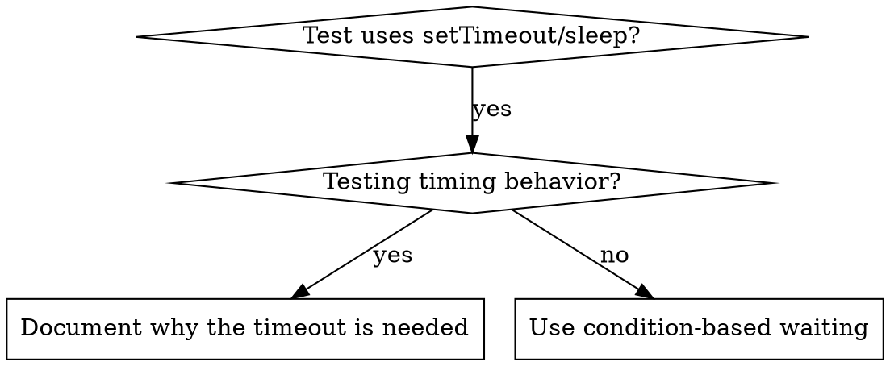

# Condition-Based Waiting
## Contents

- [Overview](#overview)
- [When to Use](#when-to-use)
- [Core Pattern](#core-pattern)
- [Quick Patterns](#quick-patterns)
- [Implementation](#implementation)
- [Common Mistakes](#common-mistakes)
- [When an Arbitrary Timeout Is Correct](#when-an-arbitrary-timeout-is-correct)
- [Real-World Effect](#real-world-effect)


## Overview

Flaky tests often guess at timing with arbitrary delays. This creates race conditions that pass on a fast machine but fail under load or in CI.

○ Core principle: do not guess at how long something will take. Wait for the condition you actually care about.

## When to Use



When to use it.

- Arbitrary delays in tests (`setTimeout`, `sleep`, `time.sleep()`)
- Tests are flaky (sometimes pass, fail under load)
- Tests time out during parallel execution
- Waiting for an async operation to complete

When not to use it.

- Testing real timing behavior (debounce or throttle intervals)
- If you use an arbitrary timeout, always document why it is needed

## Core Pattern

```typescript
// ❌ BEFORE: guessing at timing
await new Promise(r => setTimeout(r, 50));
const result = getResult();
expect(result).toBeDefined();

// ✅ AFTER: waiting on a condition
await waitFor(() => getResult() !== undefined);
const result = getResult();
expect(result).toBeDefined();
```

## Quick Patterns

| Scenario | Pattern |
|----------|------|
| Wait for an event | `waitFor(() => events.find(e => e.type === 'DONE'))` |
| Wait for a state | `waitFor(() => machine.state === 'ready')` |
| Wait for a count | `waitFor(() => items.length >= 5)` |
| Wait for a file | `waitFor(() => fs.existsSync(path))` |
| Compound condition | `waitFor(() => obj.ready && obj.value > 10)` |

## Implementation

A general-purpose polling function.

```typescript
async function waitFor<T>(
  condition: () => T | undefined | null | false,
  description: string,
  timeoutMs = 5000
): Promise<T> {
  const startTime = Date.now();

  while (true) {
    const result = condition();
    if (result) return result;

    if (Date.now() - startTime > timeoutMs) {
      throw new Error(`Timeout waiting for ${description} after ${timeoutMs}ms`);
    }

    await new Promise(r => setTimeout(r, 10)); // poll every 10ms
  }
}
```

See `condition-based-waiting-example.ts` in this directory for a complete implementation with domain-specific helpers (`waitForEvent`, `waitForEventCount`, `waitForEventMatch`) from a real debugging session.

## Common Mistakes

- ❌ Polling too fast: `setTimeout(check, 1)` causes wasted CPU
- ✅ Fix: poll every 10ms

- ❌ No timeout: loops forever if the condition is never satisfied
- ✅ Fix: always include a timeout with a clear error

- ❌ Stale data: caching state before the loop
- ✅ Fix: call the getter inside the loop for fresh data

## When an Arbitrary Timeout Is Correct

```typescript
// the tool ticks every 100ms; verifying partial output needs 2 ticks
await waitForEvent(manager, 'TOOL_STARTED'); // first: wait on the condition
await new Promise(r => setTimeout(r, 200));   // then: wait for the time-based behavior
// 200ms = two 100ms-interval ticks, documented and justified
```

Requirements.

1. Wait for the trigger condition first
2. Base it on known timing, not a guess
3. Comment on why

## Real-World Effect

In a debugging session (2025-10-03).

- Fixed 15 flaky tests across 3 files
- Pass rate: 60% → 100%
- Run time: cut by 40%
- No more race conditions
