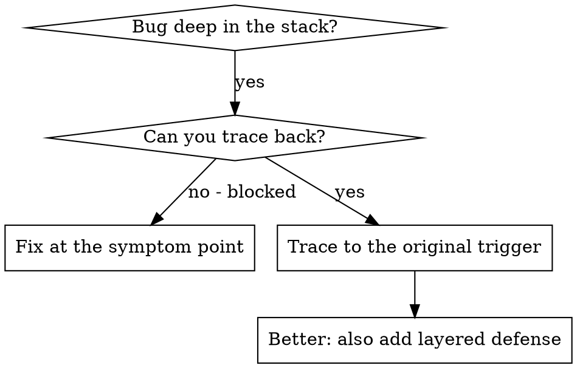
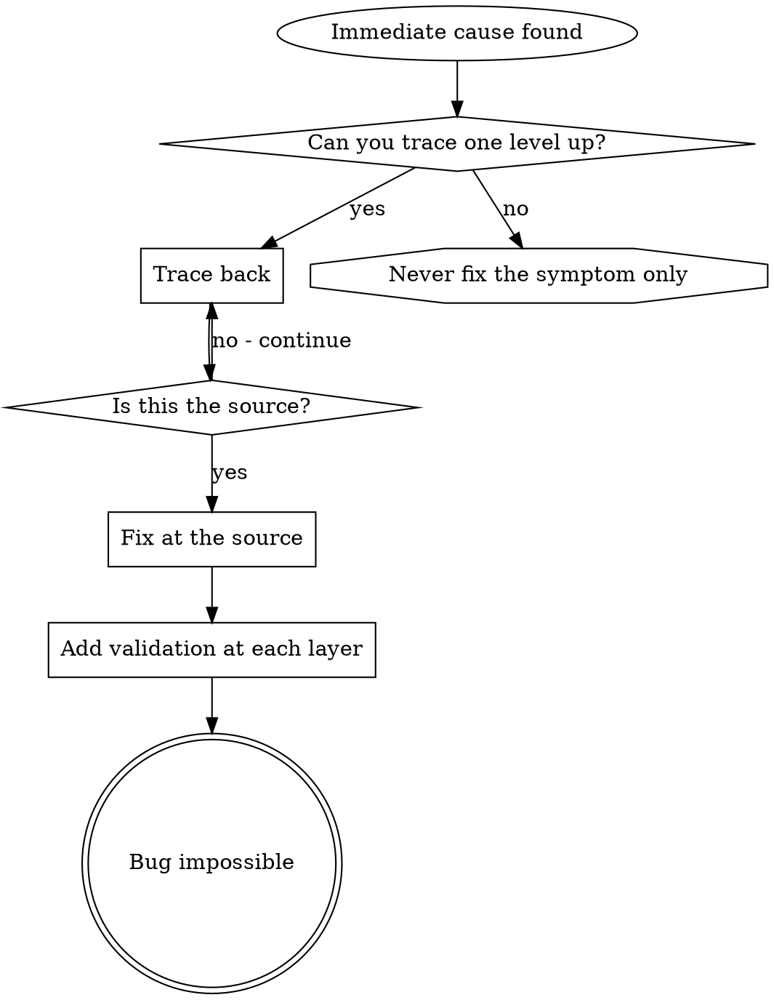

# Root Cause Tracing
## Contents

- [Overview](#overview)
- [When to Use](#when-to-use)
- [Tracing Procedure](#tracing-procedure)
  - [1. Observe the Symptom](#1-observe-the-symptom)
  - [2. Find the Immediate Cause](#2-find-the-immediate-cause)
  - [3. Ask: What Called This](#3-ask-what-called-this)
  - [4. Keep Tracing Upward](#4-keep-tracing-upward)
  - [5. Find the Original Trigger](#5-find-the-original-trigger)
- [Adding Stack Traces](#adding-stack-traces)
- [Finding Which Test Causes the Pollution](#finding-which-test-causes-the-pollution)
- [Real Example: Empty projectDir](#real-example-empty-projectdir)
- [Core Principle](#core-principle)
- [Stack Trace Tips](#stack-trace-tips)
- [Real Impact](#real-impact)


## Overview

A bug often surfaces deep in the call stack (git init in the wrong directory, a file created in the wrong location, a DB opened with the wrong path). The instinct is to fix where the error appears, but that treats the symptom.

○ Core principle: trace back up the call chain until you find the original trigger, then fix it at the source.

## When to Use



When to use.

- The error occurs deep in execution, not at the entry point
- The stack trace is a long call chain
- The source of the bad data is unclear
- You need to find which test or code triggers the problem

## Tracing Procedure

### 1. Observe the Symptom

```
Error: git init failed in /Users/jesse/project/packages/core
```

### 2. Find the Immediate Cause

What directly triggers this code.

```typescript
await execFileAsync('git', ['init'], { cwd: projectDir });
```

### 3. Ask: What Called This

```typescript
WorktreeManager.createSessionWorktree(projectDir, sessionId)
  → called by Session.initializeWorkspace()
  → called by Session.create()
  → called by test at Project.create()
```

### 4. Keep Tracing Upward

What was the value that got passed.

- `projectDir = ''` (empty string!)
- An empty string for `cwd` resolves to `process.cwd()`
- That is the source code directory!

### 5. Find the Original Trigger

Where did the empty string come from.

```typescript
const context = setupCoreTest(); // Returns { tempDir: '' }
Project.create('name', context.tempDir); // accessed before beforeEach!
```

## Adding Stack Traces

When you cannot trace manually, add instrumentation.

```typescript
// Right before the problematic operation
async function gitInit(directory: string) {
  const stack = new Error().stack;
  console.error('DEBUG git init:', {
    directory,
    cwd: process.cwd(),
    nodeEnv: process.env.NODE_ENV,
    stack,
  });

  await execFileAsync('git', ['init'], { cwd: directory });
}
```

Important: in tests, use `console.error()` (the logger may not be visible).

Run and capture.

```bash
npm test 2>&1 | grep 'DEBUG git init'
```

Analyze the stack trace.

- Look at the test file name
- Find the line number that triggered the call
- Identify the pattern (is it the same test, the same parameters)

## Finding Which Test Causes the Pollution

When something appears during tests but you do not know which test it is.

Use the bisection script `find-polluter.sh` in this directory.

```bash
./find-polluter.sh '.git' 'src/**/*.test.ts'
```

It runs the tests one by one and stops at the first source of pollution. See the script for usage.

## Real Example: Empty projectDir

Symptom: `.git` created in `packages/core/` (the source code)

Trace chain.

1. `git init` ran in `process.cwd()` ← empty cwd parameter
2. WorktreeManager was called with an empty projectDir
3. Session.create() passed an empty string
4. The test accessed `context.tempDir` before beforeEach
5. setupCoreTest() initially returned `{ tempDir: '' }`

Root cause: a top-level variable initialization that accesses an empty value

Fix: change tempDir to a getter that throws when accessed before beforeEach

Also add layered defense.

- Layer 1: Project.create() validates the directory
- Layer 2: WorkspaceManager validates that it is not empty
- Layer 3: a NODE_ENV guard rejects git init outside tmpdir
- Layer 4: stack trace logging before git init

## Core Principle



Never fix only where the error appears. Trace back and find the original trigger.

## Stack Trace Tips

- In tests: `console.error()` instead of the logger. The logger can be suppressed
- Before the operation: log before the dangerous operation, not after the failure
- Include context: directory, cwd, environment variables, timestamp
- Capture the stack: `new Error().stack` shows the full call chain

## Real Impact

From a debugging session (2025-10-03).

- A 5-step trace found the root cause
- Fixed at the source (getter validation)
- Added 4 defense layers
- 1847 tests passed, zero pollution
