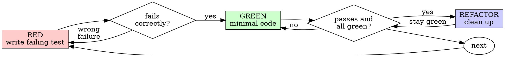

# Test-Driven Development (TDD)
## Contents

- [Overview](#overview)
- [When to apply](#when-to-apply)
- [Applicability gate](#applicability-gate)
- [The Iron Law](#the-iron-law)
- [The Red-Green-Refactor cycle](#the-red-green-refactor-cycle)
  - [RED: write a failing test](#red-write-a-failing-test)
  - [RED verification: see the failure with your own eyes](#red-verification-see-the-failure-with-your-own-eyes)
  - [GREEN: minimal code](#green-minimal-code)
  - [GREEN verification: see the pass with your own eyes](#green-verification-see-the-pass-with-your-own-eyes)
  - [Verification scope after a change](#verification-scope-after-a-change)
  - [REFACTOR: clean up](#refactor-clean-up)
  - [Repeat](#repeat)
- [Conditions of a good test](#conditions-of-a-good-test)
- [Why the order matters](#why-the-order-matters)
- [Common rationalizations](#common-rationalizations)
- [Red flags: stop and start over](#red-flags-stop-and-start-over)
- [Example: bug fix](#example-bug-fix)
- [Pre-completion verification checklist](#pre-completion-verification-checklist)
- [When you are stuck](#when-you-are-stuck)
- [Debugging integration](#debugging-integration)
- [Test anti-patterns](#test-anti-patterns)
- [Final rule](#final-rule)


## Overview

TDD starts after the target behavior is known. Write the test first, see the
failure with your own eyes, then write the minimal code that makes it pass.

If the premise, data flow, target module, or desired behavior is still unknown,
do discovery or an implementation proof first. Once the contract is clear,
freeze it with regression tests before claiming completion.

○ Core principles

- If you have not seen the test fail, you cannot know whether it checks the right thing.
- Breaking the letter of the rule is breaking the spirit of the rule.

## When to apply

□ Apply RED-first when

- The feature, bug fix, refactor, or behavior change has a resolved contract.
- The expected behavior can be stated before implementation.
- A meaningful automated test can exercise the production path.

□ Do not force RED-first yet when

- The premise, data flow, target surface, or desired behavior is unknown.
- The work is a one-off prototype, spike, or proof used to discover the contract.
- The user explicitly instructs implementation first with immediate verification.
- Code-generator output or configuration-only edits make a failing behavioral test
  inapplicable.

In these cases, run discovery or the proof under a bounded contract, then write
regression tests for the discovered behavior before completion or merge.

If the target behavior is known and the thought "let me skip TDD just this once"
comes up, stop. That is rationalization.

## Applicability gate

Before invoking RED-first TDD, answer these questions.

- What exact behavior should fail before the fix?
- Which production path will the test exercise?
- Is the expected behavior independent of the implementation you are about to
  write?

If any answer is unknown, the next step is discovery, root-cause tracing, or an
implementation proof. Do not invent a test around an unresolved premise.

## The Iron Law

```
For TDD-applicable work, do not write production code without a failing test.
```

Did you write code before the test even though the behavior contract was already
known? Delete it. Start over from the beginning.

□ No exceptions after the applicability gate passes

- Do not keep it around "for reference"
- Do not "adapt" it while writing the test
- Do not even look at it
- Deleting means actually deleting

Start from the test and implement anew.

## The Red-Green-Refactor cycle



### RED: write a failing test

Write one minimal test that shows how the behavior should work.

○ Good example

```typescript
test('retries a failed operation 3 times', async () => {
  let attempts = 0;
  const operation = () => {
    attempts++;
    if (attempts < 3) throw new Error('fail');
    return 'success';
  };

  const result = await retryOperation(operation);

  expect(result).toBe('success');
  expect(attempts).toBe(3);
});
```

Clear name, checks real behavior, checks one thing only.

○ Bad example

```typescript
test('retry works', async () => {
  const mock = jest.fn()
    .mockRejectedValueOnce(new Error())
    .mockRejectedValueOnce(new Error())
    .mockResolvedValueOnce('success');
  await retryOperation(mock);
  expect(mock).toHaveBeenCalledTimes(3);
});
```

Vague name, checks the mock's behavior and does not check the real code.

□ Requirements

- One behavior only
- Clear name
- Real code (no mocks unless unavoidable)

### RED verification: see the failure with your own eyes

Mandatory. Never skip it.

```bash
npm test path/to/test.test.ts
```

Things to confirm

- Does the test fail (not error)
- Is the failure message as expected
- Does it fail because of a missing feature, not a typo

○ Judgment

- Test passes? You are checking behavior that already exists. Fix the test.
- Test errors? Fix the error and re-run, repeating until it fails correctly.

### GREEN: minimal code

Write the simplest code that makes the test pass.

○ Good example

```typescript
async function retryOperation<T>(fn: () => Promise<T>): Promise<T> {
  for (let i = 0; i < 3; i++) {
    try {
      return await fn();
    } catch (e) {
      if (i === 2) throw e;
    }
  }
  throw new Error('unreachable');
}
```

Wrote exactly enough to pass.

○ Bad example

```typescript
async function retryOperation<T>(
  fn: () => Promise<T>,
  options?: {
    maxRetries?: number;
    backoff?: 'linear' | 'exponential';
    onRetry?: (attempt: number) => void;
  }
): Promise<T> {
  // YAGNI
}
```

Over-design. Added features that are not needed right now.

Do not add features. Do not refactor other code. Do not "improve" beyond what the test requires.

### GREEN verification: see the pass with your own eyes

Mandatory.

```bash
npm test path/to/test.test.ts
```

Things to confirm

- The test passes
- Other tests still pass
- The output is clean (no errors or warnings)

○ Judgment

- Test fails? Fix the code, not the test.
- Other tests fail? Fix them now.

### Verification scope after a change

A rerun is useful evidence only when it can fail because of the latest change.

- Rerun the previously failing test after the fix.
- Rerun directly impacted tests for adjacent production paths, shared helpers,
  fixtures, schema, installer/runtime state, or public API you changed.
- Do not repeat broad passing suites just because they are available.
- Broaden to a larger suite only when a risk signal exists, such as a shared
  dependency, changed environment, flaky-test check, generated artifact, or
  cross-platform/runtime surface.

If a broad suite already passed before the latest narrow fix, keep that result
as context. Re-run it only when the latest change can invalidate that evidence.

### REFACTOR: clean up

Do this only in the green state.

- Remove duplication
- Improve names
- Extract helpers

Keep the tests green. Do not add behavior.

### Repeat

Write the next failing test for the next feature.

## Conditions of a good test

| Quality | Good | Bad |
|------|------|------|
| Minimality | One thing only. An "and" in the name? Split it. | `test('validates email, domain, and whitespace')` |
| Clarity | The name describes the behavior | `test('test1')` |
| Intent expression | Shows the API you want | Hides what the code should do |

## Why the order matters

□ "I'll write the verification test later"

A test written later passes immediately. Something that passes immediately proves nothing.

- It may check the wrong thing
- It may check the implementation instead of the behavior
- It may miss an edge case
- You have never seen the test catch a bug

Writing the test first forces you to see the failure. This is the evidence that the test actually checks something.

□ "I already checked all the edge cases manually"

Manual testing is improvised.

- There is no record of what you tested
- You cannot re-run it when the code changes
- It is easy to forget a case under pressure
- "I tried it and it worked" ≠ comprehensive

Automated tests are systematic. They run the same way every time.

□ "Deleting X hours of work is a waste"

That is the sunk-cost fallacy. The time is already gone. The choice now is between two options.

- Delete and rewrite with TDD (X more hours, high confidence)
- Leave it as is and add tests afterward (30 minutes, low confidence, bugs may remain)

The "waste" is the side that keeps untrustworthy code. Working code with no real tests is technical debt.

□ "TDD is dogma and pragmatism is adaptation"

For TDD-applicable work, TDD is the pragmatism.

- It catches bugs before commit (faster than debugging afterward)
- It prevents regressions (it catches a break the moment it happens)
- It documents the behavior (the test shows how to use the code)
- It makes refactoring possible (change freely, and the test catches any break)

The "pragmatic" shortcut after the behavior contract is known = debugging in
production = slower. Before the contract is known, discovery or a bounded proof
is the pragmatic step.

□ "An after-the-fact test achieves the same goal. It is the spirit, not the form"

No. An after-the-fact test answers "what does this code do?" A test-first answers "what should this code do?"

An after-the-fact test is biased toward the implementation. It checks what you built, not what was required. It verifies only the edge cases you remembered, not the edge cases you discovered.

A test-first forces edge-case discovery before implementation when the intended
behavior is known. A 30-minute after-the-fact test ≠ TDD in that case. When the
premise was unknown, convert the discovered behavior into regression tests
before claiming completion.

## Common rationalizations

| Excuse | Reality |
|------|------|
| "Too simple to need a test" | Even simple code breaks. The test takes 30 seconds to write. |
| "I'll test it later" | A test that passes immediately proves nothing. |
| "An after-the-fact test has the same goal" | After = "what does it do?" / Before = "what should it do?" |
| "I already verified it manually" | Improvised ≠ systematic. No record, no re-run. |
| "It is a shame to delete X hours of work" | Sunk cost. Keeping unverified code is the debt. |
| "Keep it for reference and write the test first" | You end up adapting it. Deleting means actually deleting. |
| "I have to explore first" | If the premise or target behavior is unknown, run bounded discovery or a proof first. Once the contract is clear, lock it with tests. |
| "A hard test = unclear design" | Listen to the test. If it is hard to test, it is hard to use. |
| "TDD slows me down" | TDD is faster than debugging. Pragmatism = test-first. |
| "Manual testing is faster" | Manual cannot prove the edge cases. Re-run on every change. |
| "The existing code has no tests" | You are improving it. Add tests to the existing code. |

## Red flags: stop and start over

- Code written before the test after the behavior contract was already known
- A test written after the implementation for a known-contract change
- A test that passed immediately for behavior that should have been missing
- Cannot explain why the test failed
- A test added "later"
- The "just this once" rationalization
- "I already checked it manually"
- "An after-the-fact test has the same goal"
- "It is the spirit, not the form"
- "Keep it for reference" / "adapt the existing code"
- "I spent X hours, deleting is a shame"
- "TDD is dogma, I am pragmatic"
- "This case is different, so..."

If one of the items above appears after the applicability gate passed, delete
the code and start over with TDD. If the applicability gate did not pass, finish
the discovery/proof under a bounded contract and then add regression tests for
the discovered behavior.

## Example: bug fix

○ Bug: an empty email passes

□ RED

```typescript
test('rejects an empty email', async () => {
  const result = await submitForm({ email: '' });
  expect(result.error).toBe('Email required');
});
```

□ RED verification

```bash
$ npm test
FAIL: expected 'Email required', got undefined
```

□ GREEN

```typescript
function submitForm(data: FormData) {
  if (!data.email?.trim()) {
    return { error: 'Email required' };
  }
  // ...
}
```

□ GREEN verification

```bash
$ npm test
PASS
```

□ REFACTOR

If there are several fields, extract the validation logic.

## Pre-completion verification checklist

Confirm before declaring the work complete.

- [ ] The behavior contract was known before RED-first TDD was invoked
- [ ] Every new function or method on that known-contract path has a test
- [ ] You saw each known-contract test fail before the implementation
- [ ] Each known-contract test failed for the expected reason (a missing feature, not a typo)
- [ ] Any discovery/proof work was converted into regression coverage before completion
- [ ] You wrote the minimal code that makes each test pass
- [ ] Verification scope matches the latest change: previously failing test
      first, directly impacted tests next, broader suites only with a risk
      signal
- [ ] All tests pass
- [ ] The output is clean (no errors or warnings)
- [ ] The tests use the real code (mocks only when unavoidable)
- [ ] Edge cases and error paths are covered

Even one applicable item left unchecked? You either skipped TDD or left
discovery unconverted into regression coverage. Fix that before completion.

## When you are stuck

| Problem | Solution |
|------|------|
| I don't know how to test it | Write the API you want. Start from the assertion. Ask the user. |
| The test is too complex | The design is too complex. Simplify the interface. |
| I have to mock everything | The code is too coupled. Use dependency injection. |
| The test setup is huge | Extract it into helpers. Still complex? Simplify the design. |

## Debugging integration

Found a bug with a clear reproduction contract? Write a failing test that
reproduces it. Follow the TDD cycle. The test proves the fix and prevents the
regression.

If the reproduction contract is not clear, trace it first, then write the
regression test before completion.

## Test anti-patterns

When adding a mock or a test utility, read `references/testing-anti-patterns.md` to avoid common traps.

- Checking the mock's behavior instead of the real behavior
- Adding test-only methods to a production class
- Mocking a dependency without understanding it

## Final rule

```
Known-contract production code → a test exists, and it failed first
Unknown-premise work → bounded discovery/proof first, then regression coverage
Otherwise → not acceptable for completion
```

No exceptions without the permission of the user partner.
