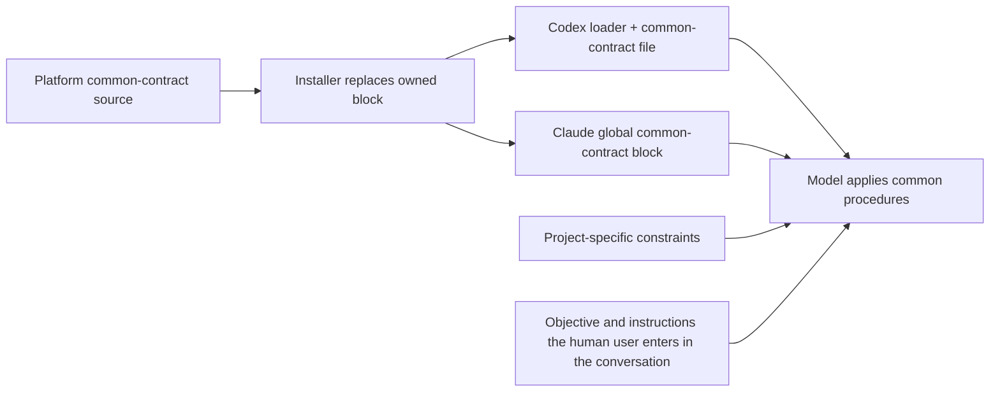

# Installation And Update Guide

[🇺🇸 English](./installation.md) | [🇰🇷 한국어](../ko/getting-started/installation.md)

This guide is the command reference for installing, updating, checking, and repairing Ghost-ALICE OS. Public guidance uses OS-native entrypoints with the same long flag surface.

- macOS, Linux, WSL, or Git Bash: `bash install.sh ...`
- From a checkout in Windows Command Prompt or PowerShell: `.\install.cmd ...`. The `cmd` examples below use Command Prompt.

On Windows, `install.cmd` keeps the native wrapper path, Python 3.11+ installer contract, UTF-8 console setup, and `-NoProfile -ExecutionPolicy Bypass`. This handles PowerShell execution policy blocks and does not change the user or machine execution policy.

The Windows installer needs PowerShell 7.6 or newer. Windows PowerShell 5.1 is not supported: under an older PowerShell the installer prints the requirement and stops. Install PowerShell with `winget install --id Microsoft.PowerShell --exact`, then rerun `.\install.cmd`.

## Contents

- [Quick Install](#quick-install)
- [Close Programs Before Installation](#close-programs-before-installation)
- [Install Addons](#install-addons)
- [Install One Platform](#install-one-platform)
- [Check Status](#check-status)
- [Update](#update)
- [Move Existing Work Records](#move-existing-work-records)
- [Common Commands](#common-commands)
- [Runtime And Platform Reference](#runtime-and-platform-reference)
- [Uninstall](#uninstall)
- [Troubleshooting](#troubleshooting)

## Quick Install

macOS, Linux, WSL, or Git Bash:

```bash
git clone https://github.com/AidALL/ghost-alice.git ~/ghost-alice
cd ~/ghost-alice
bash install.sh
```

Windows Command Prompt:

```cmd
git clone https://github.com/AidALL/ghost-alice.git %USERPROFILE%\ghost-alice
cd %USERPROFILE%\ghost-alice
.\install.cmd
```

`bash install.sh` and `.\install.cmd` fetch Core from the remote Git branch `refs/heads/main` and start the downloaded installer for the detected agent platforms. The installer uses this checkout’s `origin`, or the Ghost-ALICE GitHub repository when no remote is configured.

To install v0.6.0 exactly, extract a source archive from the [v0.6.0 release](https://github.com/AidALL/ghost-alice/releases/tag/v0.6.0) or check out its Git tag. From that folder, run `bash install.sh --local-source` or, on Windows, `.\install.cmd --local-source`. The same option installs the local files from a development checkout or saved package. A later `update` fetches remote `main`.

After a successful installation, use `~/.ghost-alice/bin/ghost-alice` (Windows: `%USERPROFILE%\.ghost-alice\bin\ghost-alice.cmd`) for status, update and removal. When an installation does not finish, run the command that a reported error names; when no error names a command, resolve the reported cause and run the same command again. The Core skills this installer places, runtime and management commands execute without the development clone. The installer attempts automatic acquisition of missing Python 3.11+, Git and Node.js and explains package-manager automatic-consent flags before acquiring the first program.

When upgrading an older installation, update every existing Core skill on each installed host before deleting the clone. Selecting only some skills leaves the others unchanged; older Claude skill links can still point into the clone, and older skill instructions can still refer to its policy files. Supply the existing skill names to the new installer, or use the fixed `update` command below, which retains those installed selections. If existing work records remain inside that folder, complete [moving existing work records](#move-existing-work-records) before moving or deleting the folder.

An earlier installer can start this release with its own install request. The release then stops with exit code 1 before it changes an installed file or the install record, and its message names the command to run: the `install.sh` (Windows: `install.cmd`) of the package saved under `~/.ghost-alice/versions/`. Run that command from a terminal. It downloads remote `main`, installs the installed Core selection and keeps the recorded install source; without an installed Core skill, it installs the selection that the stopped command saved. If the stopped command named a host or skills, add the same `--platform` option and skill names. The earlier installer prints its own failure line after this message. An update that finishes without this message needs no further command. If Git still runs the hook in a checkout's `hooks` folder, a pull installs nothing; run `bash install.sh` or `.\install.cmd` once.

## Close Programs Before Installation

Run installation and update commands from a terminal and save your work in the related hosts first. Before changing installed files, the installer checks the selected platforms, every host with an installed Core selection, and hosts involved in unfinished installations. If related host programs or record-writing CLIs are running, it displays their observed program names and process IDs (PIDs) and asks whether to request their normal exit. Answer after the question appears; input entered before each question is discarded. The installer continues only after its process observation confirms their absence.

On macOS the list shows the desktop app once for its bundled helpers. The Codex app can appear as `ChatGPT`. If you agree, the installer asks that running app to quit. A separately running CLI is listed with its own PID.

| Answer | Installer action |
| --- | --- |
| `y` or `yes` | Request normal exit for the displayed PIDs that are still observed, then check whether the programs have exited. |
| Enter, `n`, `no` or end of input (EOF) | Cancel installation with exit code 1 before changing installed files. |
| Other input | Ask again. |

A normal-exit request does not establish that a program exited. If a program remains running or a request fails, close it yourself, then press Enter to recheck or `n` to cancel. Enter rechecks the waiting programs without repeating their exit request; a newly observed PID requires a new displayed question and affirmative answer. On Windows, close windowless CLIs and programs without a supported normal-exit method yourself. If closing a related program could terminate the installer or its terminal, the installer stops and asks you to rerun from an independent terminal. If process observation fails, resolve the reported error before rechecking; an unknown state does not establish absence. The installer does not force termination. Noninteractive runs and automatic post-merge installations neither ask nor request exit: they proceed only when related programs are confirmed absent, and otherwise stop with exit code 1. The post-merge hook reports that installation result without failing the Git merge.

The release that is installed asks the exit question: the downloaded release or, with `--local-source`, the installer you started. The started command passes its terminal to the downloaded release. The saved package and the per-host installation processes recheck absence before their changes without asking again or requesting exit. These checks protect installed-file changes; Python preparation and downloads may already have occurred. After installation succeeds, [moving existing work records](#move-existing-work-records) has its own question and checks.

## Install Addons

An addon is installed from its own repository or a local path with `--addon-source PATH|URL`; add `--platform` to install it to one platform.

```bash
bash install.sh --addon-source /path/to/addon-repo
```

```cmd
.\install.cmd --addon-source C:\path\to\addon-repo
```

For git URL addon sources, `--addon-tag` selects the branch or tag to clone into the local addon source cache.

## Install One Platform

The following commands install Core only. Add `--addon-source PATH|URL` to include an addon for the selected platform.

| Target | macOS / Linux / WSL | Windows Command Prompt / PowerShell |
| --- | --- | --- |
| Claude Code | `bash install.sh --platform claude` | `.\install.cmd --platform claude` |
| Codex | `bash install.sh --platform codex` | `.\install.cmd --platform codex` |

To choose interactively:

```bash
bash install.sh --prompt-platform
```

```cmd
.\install.cmd --prompt-platform
```

## Check Status

Doctor diagnoses the installation without changing it. It returns exit code 1 when `overall` is `error`, when an unfinished add-on removal left a `.removing` marker, or when the hook status check cannot complete. Use it before changing a suspicious install. The `hook-rejections` line lists the hook commands the Ghost-ALICE hook runner refused to run in the last 14 days, one line per session with the count and the last refusal's time, hook and reason, and it does not change `overall`.

```bash
bash install.sh --doctor
bash install.sh --status
```

```cmd
.\install.cmd --doctor
.\install.cmd --status
```

The healthy target is `overall: ok`.

Doctor also prints informational Core lines: `native-intake-waits`, `native-intake-failures`, `hook-failures` and `intake-hook-degraded`. These lists do not change `overall` or the exit code. They report recorded waits, failures or degradation markers; a degradation marker alone does not establish whether an input was stored. See [intake warning and doctor lists](troubleshooting.md#intake-warning-and-doctor-lists). Doctor and status also report old record paths whose cleanup remains pending in existing move journals. These diagnostics do not move records, retry deletion or decide that the current files may be deleted.

## Update

If your installation has no `ghost-alice` management command, open its local `main` checkout that tracks the release remote’s `main` and run `git pull --ff-only`. After the pull succeeds, run `bash install.sh` or, on Windows, `.\install.cmd`. This installs Core from remote `main` and creates the management command. If you selected individual hosts or skills, pass those selections to the installer.

To update your installed copy, run the command below from any directory. The installed command fetches `main` from the remote in the install record. That release's installer updates the Core skills already installed for each host. It works without a local clone and leaves existing addons and checkout files in place.

```bash
~/.ghost-alice/bin/ghost-alice update
```

```cmd
"%USERPROFILE%\.ghost-alice\bin\ghost-alice.cmd" update
```

In PowerShell, run `& "$env:USERPROFILE\.ghost-alice\bin\ghost-alice.cmd" update` to update the installed copy. Replace `update` with `--doctor` or `--status` to check that installation.

To update both the files in your checkout (including `install.sh`) and your installed copy, run the following in a local checkout on `main` that tracks the release remote’s `main`. The shell starts the second command when Git fast-forwards the branch or reports that it is already up to date. If Git fails, the shell stops there.

```bash
git pull --ff-only && ~/.ghost-alice/bin/ghost-alice update
```

```cmd
git pull --ff-only && "%USERPROFILE%\.ghost-alice\bin\ghost-alice.cmd" update
```

In PowerShell 7, the combined command is `git pull --ff-only && & "$env:USERPROFILE\.ghost-alice\bin\ghost-alice.cmd" update`.

When Git merges new commits in the checkout registered as the install source, the [post-merge hook](#install-source) can run before the second command. The hook attempts to install the default Core skills on every detected host. The subsequent `update` reads the selections recorded at that point. Check Git’s output for the pull result and the installer’s output for the installation result.

Running `bash install.sh` (on Windows, `.\install.cmd`) again from an ordinary checkout installs the default Core skills for the detected hosts from remote `main`. If you installed from a feature branch before [change #167](https://github.com/AidALL/ghost-alice/pull/167) made remote `main` the default, append `--ref refs/heads/main` to the first example’s `update` command for the first update. If the older updater reports `Update needs its acquisition source`, the install record lacks a remote or ref. Supply both for that update. For the official repository, use `update --remote https://github.com/AidALL/ghost-alice.git --ref refs/heads/main`. After a successful update, use `update` alone.

If the install record has no remote URL, `update` uses the Ghost-ALICE GitHub repository. Pass `--remote URL` to fetch `main` from another remote. To save local edits in a Git stash before updating the checkout, see [source update recovery](./troubleshooting.md#git-update-recovery). See [installer architecture](../reference/installer-architecture.md#fixed-commands-policies-and-ledger-data) for saved-version reinstallation and ledger locations.

If a recorded Core skill has an invalid host list (`used_by`), the installer stops and identifies the installation record and skill path.

### Move Existing Work Records

After a successful installation or update, the installer checks whether work records still in use remain inside a folder used to install Ghost-ALICE. It shows that folder, the current record location and the new location at `~/.ghost-alice/session-intent`, then asks whether to move the records. The default is Yes; no separate command or migration flag is needed. Enter pressed before this question does not request a move. When several hosts share one location, the installer lists that location once.

| Answer | Installer action |
| --- | --- |
| Enter, `y` or `yes` | Request the move, then check that the affected record writers have stopped. |
| `n` or `no` | Keep the current location. |
| End of input (EOF) | Keep the current location. |
| Other input | Ask again. |

The record-movement step rechecks the hosts and other CLI work that use the displayed records, even after the [pre-installation exit check](#close-programs-before-installation). Keep those programs closed while moving records. If the installer finds a writer running, press Enter after stopping it to recheck, or `n` to keep the current location. If observation fails, inspect the reported setting or process-query error before rechecking; an unknown state does not establish that a program is running. Noninteractive runs and automatic post-merge installations do not ask for new moves, but automatically finish cleanup of already accepted moves after the required checks. Run `~/.ghost-alice/bin/ghost-alice` (Windows: `%USERPROFILE%\.ghost-alice\bin\ghost-alice.cmd`) from a terminal later to request a new move through the same follow-up after installation succeeds. Doctor reports the current locations without moving them. The exit check and follow-up use Korean or English according to the terminal language; other installation progress messages can remain in English.

The installer reports installation and record movement separately. A deferred or declined move leaves the current location in use. A move error returns a nonzero exit even when the installer restores the previous location; follow the reported recovery condition before retrying. After committing the records and settings at the new location and completing service resumption, the installer verifies and removes the old record folder. Record movement is complete only when that folder is removed; restoring the previous location never deletes it. If cleanup fails, the installer preserves the new location and new writes, reports the remaining paths and cause, and retains the cleanup journal for a later installation to retry unchanged remaining files after the reported cause is resolved. Repeating the command while that cause remains can fail again. An added or changed old file, or a host or gateway still using the old location, prevents deletion. The same follow-up handles an old folder retained by an earlier installer after verifying that its records are preserved at the new location. Other retained installation artifacts are reported separately. A successful code installation alone does not establish that records moved. The [architecture reference](../reference/installer-architecture.md#fixed-commands-policies-and-ledger-data) describes the commit and recovery conditions.

Before records and settings are committed at the new location, moving the old source folder does not change the configured record path: a later request can recreate the old path and split old and new records. The installer does not search moved folders or merge those histories automatically. If it cannot confirm which source folder an installed record location belongs to, it reports that relationship as unknown and does not offer an inferred move. Declining the move, including with `n`, `no` or end of input, keeps the records in place and permits another update from the same source. The installer retains the three most recent distinct successful versions under its usual retention rules. Reinstalling a retained version requires its code to read the current install record. Keeping records under a checkout can require schema `3` of that record even if later updates use that same checkout; a retained package that reads only schema `2` then cannot be reinstalled directly. You can keep using the active installer and decide whether to move the records on a later interactive update.

### Install Source

The install record `~/.ghost-alice/installed-payload-v2.json` or `~/.ghost-alice/installed-payload-v3.json` names the development checkout used for Git hooks and work record locations. The source commit identifies the code that was installed. Install and `--repair` compare that developer origin with the requested input origin before changing installation targets. Execution uses a fixed package; the package records its input origin separately. When the recorded checkout no longer exists, for example after a fresh clone at another path, the installer records the new checkout as the install source without asking. When both checkouts exist, such as a second clone or a git worktree, the installer shows both folders. At a terminal it asks whether this checkout replaces the install source and stops unless the answer typed at the installer's terminal question is yes (the installer does not check who typed it); elsewhere it stops with exit code 2. The same applies when another command replaces the recorded checkout while the `ghost-alice` command or the installer of a saved package downloads the release; an `update` then stops with exit code 1. When the human user decides to move the installation to another checkout, run the installer there with `--adopt-source`; its first placement records that checkout as the install source. `--repair` never moves the installation: from another checkout it stops with exit code 2 and names that install command.

If the active installer's saved package is missing files, run `--repair` from a checkout that holds the same Core files, with the addon sources of the installation; that repair restores the package. `bash install.sh update` or `.\install.cmd update` replaces the package instead: the update saves the downloaded release, without addon files, as the active package and keeps the installed Core skills, and it restores a missing file only when the downloaded release has the file list of the damaged package. The active installer runs `--repair`. An installer that you start from a checkout while the active package is complete starts the active installer with this command's host, skills and addon sources and returns its exit code; it does not compare the checkout's files. When the active package states no repair for another installer or is missing files, the started installer repairs by itself, and only when its Core files and addon sources match the saved file list. The addon sources named in the command count in this comparison only when the package lost an addon file; otherwise the package's own addon files count. When they differ, it stops and names the repair from a checkout that holds the same files, and the `update` command of the started installer with its full path, which replaces the installed Core skills with the newest release and restores no addon file. The package is no input for an entry that it lost: when the active installer itself runs the repair and its package lost a Core file, it stops with exit code 1 and names the lost entry, the repair command of the registered checkout when its installer exists, and its own `update` command when the install record identifies a checkout and installed Core skills; when the package lost an addon file and the command names no addon source that holds it, repair stops with exit code 1 and names the lost entry and `--addon-source`. An installer that lost one of its own program files stops with exit code 1 and names the repair from a checkout that holds the same Core files. Repair also stops when a surviving saved file was edited. After verifying the package, repair copies missing Core skills and the missing shared support directory from it only when the install record identifies them for the selected host in the skills folder of this command's settings. When the record names the host's skills only in another folder, repair stops with exit code 1 and names that folder. Repair stops with exit code 1 and names the install command to run when one of these holds: no installer has written the install record (it is missing, has schema `1` or holds only a service registration), and an inventory (`~/.ghost-alice/install-state/<host>.json`) cannot be read; the install record names no target of the selected host, and it names no installer or the host's inventory exists; the install record names skills of the host but not its missing shared support directory. Repair also stops with exit code 1 when a file occupies the path of that directory, and keeps the file. An installation moves an inventory that it cannot read to `<host>.json.<id>.bak` beside it and continues without it. Repair keeps the recorded release commit even when the checkout contains the same files at another commit. If the entire saved version directory is gone, repair stops and names its path. If only its `version.json` file is missing, restore that version’s file list from backup. When the installation has registered a checkout with an installer and has recorded Core skills, the error includes that checkout’s `update` command to install the latest release. If that release needs the same version directory, restore the missing file list first.

Repair verifies an intact package without copying it. Before placing any skill or shared support, it checks that the package contains every recorded Core skill for the selected skills folder. It names each missing skill and exits with code 1. Settings that reach the folder through a symlink use the same recorded destinations. The repair summary includes the addon targets it restored and the occupied addon targets it left in place. An addon failure reports its reason, the addon ID or unreadable record filename, and the target path when available.

```bash
cd /path/to/new-checkout
bash install.sh --adopt-source
```

```cmd
cd C:\path\to\new-checkout
.\install.cmd --adopt-source
```

The installer sets the repository's git hook path (`core.hooksPath`, which every worktree of the repository shares) to the fixed folder `~/.ghost-alice/git-hooks`; later installations keep this setting. If it cannot write the setting or the folder, it stops before the install record or a host file changes; see [Git hook registration failure](./troubleshooting.md#git-hook-registration-failure). After a merge or pull in the install source, the post-merge hook in that folder runs the installed `ghost-alice`, which fetches `main` from the registered remote and installs it for every detected host. A merge or pull in another worktree of the same repository runs the same hook, never that worktree's own hook file; the hook prints one line and installs nothing. A worktree's own hook setting (`git config --worktree core.hooksPath`) still comes first. Only an install you run replaces the install source; a merge never does, and a merge never fails because of the hook. Removal of the last consumer of the management commands puts back the hook path from before the install, unless the path changed since.

## Common Commands

| Purpose | macOS / Linux / WSL | Windows Command Prompt / PowerShell |
| --- | --- | --- |
| List skills | `bash install.sh --list` | `.\install.cmd --list` |
| Show install state | `bash install.sh --status` | `.\install.cmd --status` |
| Run protected diagnostic | `bash install.sh --doctor` | `.\install.cmd --doctor` |
| Stash local edits and update the checkout | `bash install.sh --update-source` | `.\install.cmd --update-source` |
| Install an addon | `bash install.sh --addon-source /path/to/addon-repo` | `.\install.cmd --addon-source C:\path\to\addon-repo` |
| Selective core install | `bash install.sh task-router verification-before-completion` | `.\install.cmd task-router verification-before-completion` |
| Full uninstall | `bash install.sh --uninstall` | `.\install.cmd --uninstall` |
| Selective uninstall | `bash install.sh --platform codex --uninstall task-router` | `.\install.cmd --platform codex --uninstall task-router` |
| Clean false pending entries | `bash install.sh --platform claude --cleanup-pending` | `.\install.cmd --platform claude --cleanup-pending` |

## Runtime And Platform Reference

### Agent Visibility Profile

The default profile is `dynamic`. The profile controls how much governance surface is shown to the user; it does not reduce hook installation or execution, the hook log (`~/.ghost-alice/session-logs/<host>/<session>/strict-hook-output.jsonl`), audit records or Work-Impact Projection.

The [Ghost-ALICE intake warning](./troubleshooting.md#intake-warning-and-doctor-lists) appears under every profile.

| Profile | macOS / Linux / WSL | Windows Command Prompt / PowerShell |
| --- | --- | --- |
| strict | `bash install.sh --visibility strict` | `.\install.cmd --visibility strict` |
| dynamic | `bash install.sh --visibility dynamic` | `.\install.cmd --visibility dynamic` |
| minimal | `bash install.sh --visibility minimal` | `.\install.cmd --visibility minimal` |

`--agent-visibility` remains an accepted compatibility alias. Prefer `--visibility` in new docs and commands.

### Slash Commands By Platform

Ghost-ALICE installs `/visibility strict|dynamic|minimal` as a Claude Code workspace command. Every platform, including Codex, can inspect and change the same profile value through `_shared/agent_visibility_cli.py`. Codex has no `/visibility` command.

### Python Contract

The installer requires Python 3.11 or newer for every command, `--help` and `--list` included: `install.sh` only finds or prepares Python and hands the arguments to `_shared/installer/cli.py`. If Python 3.11+ is missing, it attempts automatic preparation where possible.

The optional macOS native context gateway requires Python 3.14 or newer with `compression.zstd`. Its registration command, `bash install.sh gateway --codex-dir <dir> --ledger-root <dir> --state-dir <dir> --launch-agent <plist>`, checks that capability first, then writes the launch agent, `state.json` and the Codex provider blocks and records the service in the install record. It copies no module: the service runs the runtime `_shared` the installer published, so install Core first. This component requirement does not change the Core installer and hook minimum of Python 3.11. If Codex `config.toml`, the launch agent or a state file is a symlink, registration and detachment stop before changing the service and preserve the link and its target. A refresh keeps the listener's port and scope while the three service files are as the install record says; a file changed outside the installer stops the command before any change, and an existing launch agent, state directory entry or provider block the record does not name is preserved. If a first registration fails and the candidate service is confirmed stopped, rollback removes that attempt's new state artifacts and record entry so a new attempt can proceed. An uncertain stop or concurrent artifact change preserves recovery material for review. After registration, the [installed update command](#update) refreshes each host’s installed Core skills and the runtime used by the gateway. `bash install.sh gateway detach --apply` unregisters the service and keeps its state directory. When launchd runs a gateway service that the install record does not name, install and `--repair` leave that service as it is and print one warning that names the registration command; the registration records the service and restarts it on the new code.

- macOS: if Homebrew is available, `brew install python3`
- Linux / WSL: available package managers such as `apt-get`, `dnf`, `yum`, or `pacman`
- Windows: `winget`, `choco`, then `scoop`

If Python 3.11+ is still unavailable, installation stops and prints manual recovery guidance.

### PowerShell Contract

`.\install.cmd` runs the Windows installer with PowerShell 7 (`pwsh.exe`), and with Windows PowerShell (`powershell.exe`) when `pwsh.exe` is absent. The Windows installer needs PowerShell 7.6 or newer, the 7.6 LTS line. Under an older PowerShell, Windows PowerShell 5.1 included, it prints `PowerShell 7.6 or newer is required` with the install command `winget install --id Microsoft.PowerShell --exact` and stops with exit code 1; the installer never installs PowerShell itself. After that check, it sets UTF-8 console input and output, prepares Python 3.11+ and passes every argument in order to `_shared/installer/cli.py`, the same installer that `install.sh` runs, so Windows accepts the same long flags.

On macOS and other POSIX hosts, installed hooks try `GHOST_ALICE_PYTHON` first, then Python from the runtime `PATH` and common installation locations, and finally the interpreter used by the installer. Each candidate must pass the Python 3.11+ check. This final fallback lets a desktop app run hooks even when its `PATH` omits the installer's Python directory. It does not change the host's global Python or `PATH`; rerun the installer if that interpreter moves and no other candidate is available.

### Node.js Contract

Claude Code and Codex hook-enabled installs require a resolvable Node.js runtime because the `tool-checkpoint` PreToolUse gate runs `ghost-alice-hook.mjs`. The installer checks configured runtimes, the platform registration and `PATH`, including the configured Codex runtime fallback. It blocks hook installation only when the target platform requires hooks and no usable Node runtime resolves.

### Platform Update Behavior

| Host | Core placement | Skill path |
| --- | --- | --- |
| Claude Code | Copy | `~/.claude/skills/` |
| Codex | Copy | `~/.agents/skills/` |

Every supported OS receives Core and `_shared` as copies. Editing development files does not alter installed Core; update or an explicit install publishes new code. Addon link/copy policy remains separate. An existing Codex `untrusted` setting stays unless the installer obtains confirmation for that exact project.


### Core and addon transitions

Core installation and addon removal are separate operations. A fresh Core installation supplies the instructions, input/source bindings, work and review records, and Core hooks. Updating Core without an addon option preserves an already installed addon; `--addon-skip` skips addon installation and does not request its removal.

| Operation | Command or procedure | What changes |
| --- | --- | --- |
| Install the default Core skills on Codex | `bash install.sh --platform codex` | Install all default Core skills on Codex and keep existing addons |
| Update the Core skills already installed on each host | [Run the installed update command](#update) | Read each host’s Core skill selection from the install record and keep existing addons |
| Add or update an addon | `bash install.sh --platform codex --addon-source /path/to/addon-repo` | Core plus the addon's manifest-selected skills and observational hooks |
| Remove an addon while retaining Core | `bash install.sh --platform codex --uninstall --addon <addon-id>` | Detach recorded addon hooks before removing verified addon targets |
| Remove one platform | `bash install.sh --platform codex --uninstall` | That platform's addons and Core; retain shared assets needed by other installed platforms |

Removing an addon retains Core records. Per-addon removal keeps modified files and its sidecar/removal marker for review or retry, while detaching its managed executable registrations. This is a configuration/file operation; ongoing-host adoption and cancellation of already delivered work are separate observations.

Full/platform removal archives pending merge originals and last-platform installation recovery copies under unique `~/.ghost-alice/uninstall-backup/<platform>/support-state/` directories. It keeps previous archives, source checkouts, conversation/session evidence, records at the current ledger location, audit traces and secrets. See [uninstall cleanup](./uninstall.md) for ownership and shared-file rules.

For Claude Code, the installer records which manifest-selected addon `Skill(...)` allow rules it actually added in `~/.ghost-alice/addon-permissions/claude-v2.json`. The uninstaller clears one owned occurrence and preserves preexisting rules and later duplicate rules that this installer did not add. The uninstaller preserves a legacy rule without ownership evidence for the human user to review. For Codex, the uninstaller clears unchanged owned hook trust hashes and moves surviving Core hook trust entries and the entries of hooks Ghost-ALICE did not install with their hook positions, preserving their metadata; the installer does not record who wrote the latter entries. A trust collision or configuration write failure prevents successful file removal; see [uninstall cleanup](./uninstall.md).

### Installed Surfaces

A full install deploys:

- core skills from `skill-catalog/skills.json`
- coding-convention workflow skills
- optional addon skills through `--addon-source`
- `_shared/` utilities
- platform hook settings
- Node-backed hook dispatcher assets under `~/.ghost-alice/hooks/`
- the fixed Git hook folder `~/.ghost-alice/git-hooks/`: the `post-merge` script and `repositories.json`, which keeps the previous hook path of each registered repository
- Claude Code permission allowlist
- Claude `${CLAUDE_CONFIG_DIR:-~/.claude}/CLAUDE.md` global bootstrap
- Codex `~/.codex/AGENTS.md` loader and managed `~/.codex/ghost-alice-governance.md` common contract
- the install record `~/.ghost-alice/installed-payload-v2.json` or `~/.ghost-alice/installed-payload-v3.json`: one file for both hosts that names every install location, its source and the fingerprints of copied files, written in the same step as each placement
- `~/.ghost-alice/rollbacks/<txid>/`: the files one placement replaced, the install record as it was before, and the placement's journal; the next locked installer command restores a placement that stopped halfway, and [runtime state retention](../reference/repository-structure.md#runtime-state-retention) sets how many finished folders stay
- support state for install-state, pending merges, and uninstall reports

An installation that registered the optional context gateway: the install record's `service` section names the service's code root, `~/.ghost-alice/runtime/current`, and its three service files. The runtime placement (`_shared` and the companion script `session-intent-analyzer/scripts/session_intent_ledger.py`) stops the service before its files change and starts it after. The installer handles this restart during both installation and update. The install prints one `Context gateway:` line with the service's runtime root and whether the service is running. An installation an earlier installer registered gets its `service` section once from the gateway's installation receipt, at the first install, repair or uninstall.

The installer owns only the marked Ghost-ALICE block in each global rule file. It refreshes that block while preserving text outside the bootstrap. If the destination is a file without a Ghost-ALICE marker, installation leaves it unchanged, writes `<rule-file>.ghost-alice-proposed`, and status/doctor does not report the proposal as an installed global rule.

### Common Governance and Project Instructions

Ghost-ALICE common governance applies across projects and task domains. On a normal Codex route, the response model reads the common contract at the path rendered into the managed `~/.codex/AGENTS.md` loader. The installer writes that contract to the sibling `ghost-alice-governance.md`. Claude Code receives the common contract directly in the managed portion of `${CLAUDE_CONFIG_DIR:-~/.claude}/CLAUDE.md`. Project instruction files add project-specific constraints; they do not supply a second copy of the common procedures. The common contract's [Operating Model](https://github.com/AidALL/ghost-alice/blob/main/platforms/common-governance.md#operating-model) defines the precedence of instructions that the human user enters in the conversation and the constraints stated in instruction files.


```mermaid
flowchart LR
    S["Platform common-contract source"] --> I["Installer replaces owned block"]
    I --> C["Codex loader + common-contract file"]
    I --> H["Claude global common-contract block"]
    C --> M["Model applies common procedures"]
    H --> M
    P["Project-specific constraints"] --> M
    U["Objective and instructions the human user enters in the conversation"] --> M
```

If Codex cannot read the named common file, the model tells the user once that the Ghost-ALICE contract is missing and continues the user's work without writing Ghost-ALICE ledger records. On Codex, when no tool is needed, the model answers directly without reading the common file; when it is unclear whether a tool is needed, it treats the request as work and reads the common file first. Status and doctor check the loader and its declared companion together. The installer preserves text outside the bootstrap and rule files without a Ghost-ALICE marker; it refuses to replace a Codex common contract through a symlink. A proposal is not an installed contract. The installer does not change unrelated projects' instruction budgets or rewrite their local rules.


### merge-companion

When an update detects external changes in installed files, the installer isolates those candidates in a pending merge queue. External changes are changes the installer finds in installed targets after install that its records do not hold; the installer does not record who made them.

- manifest: `~/.ghost-alice/pending-merges/<platform>/manifest.json`
- backup: `~/.ghost-alice/pending-merges/<platform>/`
- install state: `~/.ghost-alice/install-state/<platform>.json`

On the next Claude Code/Codex session, the hook reports pending entries. When the human user asks to review them, or when work changes an affected skill, the response model follows `merge-companion` to ask the human user whether to merge, discard or defer each entry.

## Uninstall

Uninstall uses the installer-owned install-state manifest and removes only the Ghost-ALICE managed block from the platform global rule file. Text outside the bootstrap remains in place.

```bash
bash install.sh --uninstall
```

```cmd
.\install.cmd --uninstall
```

See [uninstall cleanup](./uninstall.md) for the full cleanup contract.

## Troubleshooting

When an update is blocked during `git pull`, a merge conflict, or an installer rerun, start with [troubleshooting](./troubleshooting.md).
